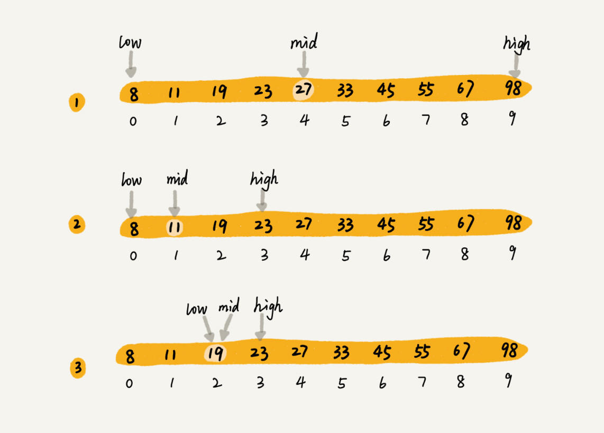

### 二分查找的原理
**二分查找针对的是一个有序的数据集合，查找思想有点类似分治思想。每次都通过跟区间的中间元素对比，将待查找的区间缩小为之前的一半，直到找到要查找的元素，或者区间被缩小为 0。**

**示例：**
假设有 1000 条订单数据，已经按照订单金额从小到大排序，每个订单金额都不同，并且最小单位是元。我们现在想知道是否存在金额等于 19 元的订单。如果存在，则返回订单数据，如果不存在则返回 null。
为了方便讲解，我们假设只有 10 个订单，订单金额分别是：8，11，19，23，27，33，45，55，67，98。

<!--more-->

为了更加直观，我画了一张查找过程的图。其中，low 和 high 表示待查找区间的下标，mid 表示待查找区间的中间元素下标。


<div style="clear: both"></div>

### 二分查找的时间复杂度

二分查找是一种非常高效的查找算法，

我们假设数据大小是 n，每次查找后数据都会缩小为原来的一半，也就是会除以 2。最坏情况下，直到查找区间被缩小为空，才停止。

<div style="clear: both"></div>

可以看出来，这是一个等比数列。其中 n/2k=1 时，k 的值就是总共缩小的次数。而每一次缩小操作只涉及两个数据的大小比较，所以，经过了 k 次区间缩小操作，时间复杂度就是 O(k)。通过 n/2k=1，我们可以求得 k=log2n，**所以时间复杂度就是 O(logn)**。

二分查找是我们目前为止遇到的第一个时间复杂度为 O(logn) 的算法。这种对数时间复杂度是一种极其高效的时间复杂度，有的时候甚至比时间复杂度是常量级 O(1) 的算法还要高效。因为 logn 是一个非常“恐怖”的数量级，即便 n 非常非常大，对应的 logn 也很小。比如 n 等于 2 的 32 次方，这个数很大了吧？大约是 42 亿。也就是说，如果我们在 42 亿个数据中用二分查找一个数据，最多需要比较 32 次。

我们前面讲过，用大 O 标记法表示时间复杂度的时候，会省略掉常数、系数和低阶。对于常量级时间复杂度的算法来说，O(1) 有可能表示的是一个非常大的常量值，比如 O(1000)、O(10000)。所以，常量级时间复杂度的算法有时候可能还没有 O(logn) 的算法执行效率高。

### 二分查找代码实现（循环）

**最简单的情况就是有序数组中不存在重复元素**，我们在其中用二分查找值等于给定值的数据。

伪代码示例：
```
public int bsearch(int[] a, int n, int value) {
  int low = 0;
  int high = n - 1;

  while (low <= high) {
    int mid = (low + high) / 2;
    if (a[mid] == value) {
      return mid;
    } else if (a[mid] < value) {
      low = mid + 1;
    } else {
      high = mid - 1;
    }
  }

  return -1;
}
```
注意：
* 循环退出条件：是 low<=high，而不是 low<high；
* mid 的取值：
实际上，mid=(low+high)/2 这种写法是有问题的。因为如果 low 和 high 比较大的话，两者之和就有可能会溢出。改进的方法是将 mid 的计算方式写成 low+(high-low)/2。更进一步，如果要将性能优化到极致的话，我们可以将这里的除以 2 操作转化成位运算 low+((high-low)>>1)。因为相比除法运算来说，计算机处理位运算要快得多。
* low 和 high 的更新；

### 二分查找代码实现（递归）

伪代码示例：
```
// 二分查找的递归实现
public int bsearch(int[] a, int n, int val) {
  return bsearchInternally(a, 0, n - 1, val);
}

private int bsearchInternally(int[] a, int low, int high, int value) {
  if (low > high) return -1;

  int mid =  low + ((high - low) >> 1);
  if (a[mid] == value) {
    return mid;
  } else if (a[mid] < value) {
    return bsearchInternally(a, mid+1, high, value);
  } else {
    return bsearchInternally(a, low, mid-1, value);
  }
}
```

### 二分查找的条件限制
* 二分查找依赖的是**顺序表结构，简单点说就是数组**：
主要原因是二分查找算法需要按照下标随机访问元素。我们在数组和链表那两节讲过，数组按照下标随机访问数据的时间复杂度是 O(1)，而链表随机访问的时间复杂度是 O(n)。所以，如果数据使用链表存储，二分查找的时间复杂就会变得很高。
* 二分查找针对的是**有序数据**：
如果数据没有序，我们需要先排序。前面章节里我们讲到，排序的时间复杂度最低是 O(nlogn)。所以，如果我们针对的是一组静态的数据，没有频繁地插入、删除，我们可以进行一次排序，多次二分查找。这样排序的成本可被均摊，二分查找的边际成本就会比较低。（不适合动态插入、删除的数据集合）
* 数据量太小不适合二分查找：
如果要处理的数据量很小，完全没有必要用二分查找，顺序遍历就足够了。不过，这里有一个例外。如果数据之间的比较操作非常耗时，不管数据量大小，我都推荐使用二分查找。
* 数据量太大也不适合二分查找：
二分查找的底层需要依赖数组这种数据结构，而数组为了支持随机访问的特性，要求内存空间连续，对内存的要求比较苛刻。

### 解答开篇
二分查找底层依赖的是数组，除了数据本身之外，不需要额外存储其他信息，是最省内存空间的存储方式，所以刚好能在限定的内存大小下解决这个问题。