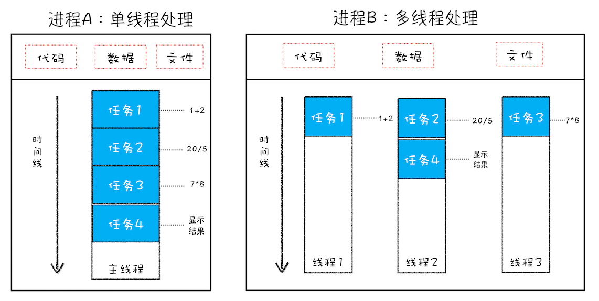

### 进程和线程
多线程可以并行处理任务，但是线程是不能单独存在的，它是由进程来启动和管理的。

一个进程就是一个程序的运行实例。详细解释就是，启动一个程序的时候，操作系统会为该程序创建一块内存，用来存放代码、运行中的数据和一个执行任务的主线程，我们把这样的一个运行环境叫进程。

<!--more-->

从图中可以看到，线程是依附于进程的，而进程中使用多线程并行处理能提升运算效率。

**进程和线程的关系：**
* 进程中的任意一线程执行出错，都会导致整个进程的崩溃；
* 线程之间共享进程中的数据；
* 当一个进程关闭之后，操作系统会回收进程所占用的内存；
* 进程之间的内容相互隔离；

### 从单进程时代进入多进程浏览器时代

从图中可以看出，最新的 Chrome 浏览器包括：1 个浏览器（Browser）主进程、1 个 GPU 进程、1 个网络（NetWork）进程、多个渲染进程和多个插件进程。下面我们来逐个分析下这几个进程的功能。
* 浏览器进程：主要负责界面显示、用户交互、子进程管理，同时提供存储等功能。
* 渲染进程：核心任务是将 HTML、CSS 和 JavaScript 转换为用户可以与之交互的网页，排版引擎 Blink 和 JavaScript 引擎 V8 都是运行在该进程中，默认情况下，Chrome 会为每个 Tab 标签创建一个渲染进程。出于安全考虑，渲染进程都是运行在沙箱模式下。
* GPU 进程：其实，Chrome 刚开始发布的时候是没有 GPU 进程的。而 GPU 的使用初衷是为了实现 3D CSS 的效果，只是随后网页、Chrome 的 UI 界面都选择采用 GPU 来绘制，这使得 GPU 成为浏览器普遍的需求。最后，Chrome 在其多进程架构上也引入了 GPU 进程。
* 网络进程：主要负责页面的网络资源加载，之前是作为一个模块运行在浏览器进程里面的，直至最近才独立出来，成为一个单独的进程。
* 插件进程：主要是负责插件的运行，因插件易崩溃，所以需要通过插件进程来隔离，以保证插件进程崩溃不会对浏览器和页面造成影响。

讲到这里，现在你应该就可以回答文章开头提到的问题了：仅仅打开了 1 个页面，为什么有 4 个进程？因为打开 1 个页面至少需要 1 个网络进程、1 个浏览器进程、1 个 GPU 进程以及 1 个渲染进程，共 4 个；如果打开的页面有运行插件的话，还需要再加上 1 个插件进程。