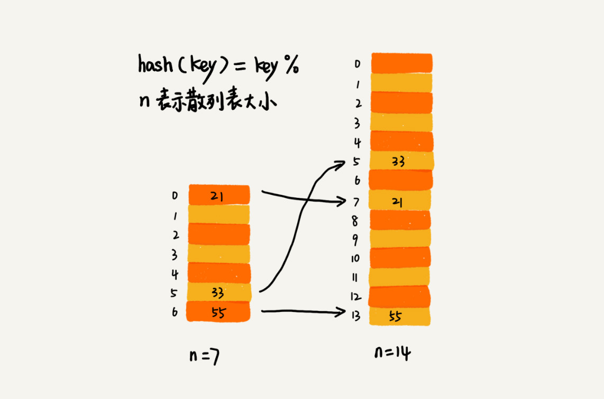

### 散列表潜在威胁

我们知道，散列表的查询效率并不能笼统地说成是 O(1)。它跟散列函数、装载因子、散列冲突等都有关系。如果散列函数设计得不好，或者装载因子过高，都可能导致散列冲突发生的概率升高，查询效率下降。

在极端情况下，有些恶意的攻击者，还有可能通过精心构造的数据，使得所有的数据经过散列函数之后，都散列到同一个槽里。如果我们使用的是基于链表的冲突解决方法，那这个时候，散列表就会退化为链表，查询的时间复杂度就从 O(1) 急剧退化为 O(n)。

<!--more-->

如果散列表中有 10 万个数据，退化后的散列表查询的效率就下降了 10 万倍。更直接点说，如果之前运行 100 次查询只需要 0.1 秒，那现在就需要 1 万秒。这样就有可能因为查询操作消耗大量 CPU 或者线程资源，导致系统无法响应其他请求，从而达到拒绝服务攻击（DoS）的目的。这也就是**散列表碰撞攻击的基本原理**。

### 如何设计散列函数

**散列函数设计的好坏，决定了散列表冲突的概率大小，也直接决定了散列表的性能。**

首先，散列函数的设计不能太复杂。过于复杂的散列函数，势必会消耗很多计算时间，也就间接的影响到散列表的性能。其次，散列函数生成的值要尽可能随机并且均匀分布，这样才能避免或者最小化散列冲突，而且即便出现冲突，散列到每个槽里的数据也会比较平均，不会出现某个槽内数据特别多的情况。

实际工作中，我们还需要综合考虑各种因素。这些因素有关键字的长度、特点、分布、还有散列表的大小等。散列函数各式各样，我举几个常用的、简单的散列函数的设计方法，让你有个直观的感受。

* 第一个例子就是我们上一节的学生运动会的例子，我们通过分析参赛编号的特征，把编号中的后两位作为散列值。我们还可以用类似的散列函数处理手机号码，因为手机号码前几位重复的可能性很大，但是后面几位就比较随机，我们可以取手机号的后四位作为散列值。这种散列函数的设计方法，我们一般叫作“数据分析法”。

* 第二个例子就是上一节的开篇思考题，如何实现 Word 拼写检查功能。这里面的散列函数，我们就可以这样设计：将单词中每个字母的ASCll 码值“进位”相加，然后再跟散列表的大小求余、取模，作为散列值。

### 装载因子过大了怎么办？

针对散列表，当装载因子过大时，我们也可以进行动态扩容，重新申请一个更大的散列表，将数据搬移到这个新散列表中。假设每次扩容我们都申请一个原来散列表大小两倍的空间。如果原来散列表的装载因子是 0.8，那经过扩容之后，新散列表的装载因子就下降为原来的一半，变成了 0.4。

针对数组的扩容，数据搬移操作比较简单。但是，针对散列表的扩容，数据搬移操作要复杂很多。因为散列表的大小变了，数据的存储位置也变了，所以我们需要通过散列函数重新计算每个数据的存储位置。

如下图例子，在原来的散列表中，21 这个元素原来存储在下标为 0 的位置，搬移到新的散列表中，存储在下标为 7 的位置。

#### 动态扩容的时间复杂度
对于支持动态扩容的散列表，插入一个数据，最好情况下，不需要扩容，最好时间复杂度是 O(1)。最坏情况下，散列表装载因子过高，启动扩容，我们需要重新申请内存空间，重新计算哈希位置，并且搬移数据，所以时间复杂度是 O(n)。用摊还分析法，均摊情况下，时间复杂度接近最好情况，就是 O(1)。

**当散列表的装载因子超过某个阈值时，就需要进行扩容。装载因子阈值需要选择得当。如果太大，会导致冲突过多；如果太小，会导致内存浪费严重。**

### 如何避免低效地扩容？
大部分情况下，动态扩容的散列表插入一个数据都很快，但是在特殊情况下，当装载因子已经到达阈值，需要先进行扩容，再插入数据。这个时候，插入数据就会变得很慢，甚至会无法接受。
举一个极端的例子，如果散列表当前大小为 1GB，要想扩容为原来的两倍大小，那就需要对 1GB 的数据重新计算哈希值，并且从原来的散列表搬移到新的散列表，听起来就很耗时，是不是？
为了解决一次性扩容耗时过多的情况，我们可以将扩容操作穿插在插入操作的过程中，分批完成。当装载因子触达阈值之后，我们只申请新空间，但并不将老的数据搬移到新散列表中。
当有新数据要插入时，我们将新数据插入新散列表中，并且从老的散列表中拿出一个数据放入到新散列表。每次插入一个数据到散列表，我们都重复上面的过程。经过多次插入操作之后，老的散列表中的数据就一点一点全部搬移到新散列表中了。这样没有了集中的一次性数据搬移，插入操作就都变得很快了。
对于查询操作，为了兼容了新、老散列表中的数据，我们先从新散列表中查找，如果没有找到，再去老的散列表中查找。
通过这样均摊的方法，将一次性扩容的代价，均摊到多次插入操作中，就避免了一次性扩容耗时过多的情况。这种实现方式，任何情况下，插入一个数据的时间复杂度都是 O(1)。

### 散列冲突解决方案的优劣分析

#### 开放寻址法
* 优势： 开放寻址法不像链表法，需要拉很多链表。散列表中的数据都存储在数组中，可以有效地利用 CPU 缓存加快查询速度。而且，这种方法实现的散列表，序列化起来比较简单。链表法包含指针，序列化起来就没那么容易；
* 劣势：用开放寻址法解决冲突的散列表，删除数据的时候比较麻烦，需要特殊标记已经删除掉的数据。而且，在开放寻址法中，所有的数据都存储在一个数组中，比起链表法来说，冲突的代价更高。所以，使用开放寻址法解决冲突的散列表，装载因子的上限不能太大。这也导致这种方法比链表法更浪费内存空间；

**总结：当数据量比较小、装载因子小的时候，适合采用开放寻址法。这也是 Java 中的ThreadLocalMap使用开放寻址法解决散列冲突的原因。**

#### 链表法
* 优势：链表法对内存的利用率比开放寻址法要高。因为链表结点可以在需要的时候再创建，并不需要像开放寻址法那样事先申请好；
* 优势：链表法比起开放寻址法，对大装载因子的容忍度更高。开放寻址法只能适用装载因子小于 1 的情况。接近 1 时，就可能会有大量的散列冲突，导致大量的探测、再散列等，性能会下降很多。但是对于链表法来说，只要散列函数的值随机均匀，即便装载因子变成 10，也就是链表的长度变长了而已，虽然查找效率有所下降，但是比起顺序查找还是快很多；
* 劣势：链表因为要存储指针，所以对于比较小的对象的存储，是比较消耗内存的，还有可能会让内存的消耗翻倍。而且，因为链表中的结点是零散分布在内存中的，不是连续的，所以对 CPU 缓存是不友好的，这方面对于执行效率也有一定的影响；

**总结：基于链表的散列冲突处理方法比较适合存储大对象、大数据量的散列表，而且，比起开放寻址法，它更加灵活，支持更多的优化策略，比如用红黑树代替链表。**

### 如何设计一个工业级的散列表
要求：
* 支持快速的查询、插入、删除操作；
* 内存占用合理，不能浪费过多的内存空间；
* 性能稳定，极端情况下，散列表的性能也不会退化到无法接受的情况。

实现方案：
* 设计一个合适的散列函数；
* 定义装载因子阈值，并且设计动态扩容策略；
* 选择合适的散列冲突解决方法；