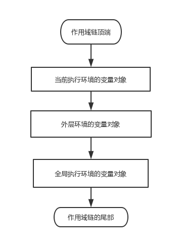

## 基本类型和引用类型的值
### 传递参数
* 传递基本类型的值，相当于把值复制到另一个地址，和原变量互不影响
```
function addTen(num) {
  num += 10;
  return num;
}

var count = 20;
var result = addTen(count);
alert(count); // 20,没有变化
alert(result); // 30
```
* 传递引用类型的值，参数和原变量都指向同一个对象
```
function setName(obj) {
  obj.name = "Nicholas";
}

var person = new Object();
setName(person);
alert(person.name); // "Nicholas"
```

<!--more-->

### 检测数据类型
* 基本数据类型，用typeof
* 引用类型，用instanceof
```
alert(person instanceof Object); 
```

## 执行环境及作用域

### 作用域链
* 标示符解析沿作用域链逐级搜索

* 延长作用域链
  1. try-catch语句的catch块；
  2. with语句。

### ES6的块级作用域
* let命令声明变量
* 解决for循环计数器问题
```
var a = [];
for (var i = 0; i < 10; i++) {
  a[i] = function () {
    console.log(i);
  };
}
a[6](); // 10

// 解决方案：
var a = [];
for (let i = 0; i < 10; i++) {
  a[i] = function () {
    console.log(i);
  };
}
a[6](); // 6
```
* 不存在变量提升
var命令会发生“变量提升”现象，即变量可以在声明之前使用，值为undefined。这种现象多多少少是有些奇怪的，按照一般的逻辑，变量应该在声明语句之后才可以使用。  
为了纠正这种现象，let命令改变了语法行为，它所声明的变量一定要在声明后使用，否则报错。

## 引用类型
### Object类型
#### 创建Object实例
* 利用构造函数
```
var person = new Object();
```
* 使用对象字面量方法
```
var person = {
  name: 'Nicholoas'
};
```

### Array类型
#### 创建Array对象
```
var colors = new Array();
var colors = new Array(3); // 3为length
var colors = new Array('red', 'blue', 'green'); // 包括三项：'red', 'blue', 'green'
var colors = ['red', 'blue', 'green'];
```
#### 利用length属性可以再数组末尾添加或删除一项
```
var colors1 = ['red', 'blue', 'green'];
colors1.lenght = 2; // 删除最后一项

var colors2 = ['red', 'blue', 'green'];
colors2.length = 4;
alert(colors2[3]); // 新增一项undefined
```

#### 检测数组
* Array.isArray(value)

#### 数组的方法

* join：拼接数组
```
var colors = ['red', 'blue', 'green'];
alert(colors.join('||')); // 'red'||'blue'||'green'
```

* 栈方法（LastInFirstOut）：push(), pop()
* 队列方法 (FirstInFirstOut)：push(), shift()
* 在数组头部添加任意项，返回长度：unshift()
* 排序方法：reverse(), sort()
```
// sort接收一个比较函数
function compare (v1, v2) {
  if (v1 < v2) {
    // v1位于v2前面
    return -1
  } else if (v1 > v2) {
    // v1位于v2后面
    return 1
  } else {
    // v1和v2相等
    return 0
  }
}

// 简化版：
function compare (v1, v2) {
  return v2 - v1;
}
```

* 操作方法：
  1. concat()：不会修改原数组
  2. slice(start, end)：不会修改原数组
  3. splice(pos, num, ele1, ele2, ...)：可以用来删除、插入、替换数组元素, 返回删除元素组成的数组， 会修改原数组

* 位置方法：
  1. indexOf(ele, pos)：从数组开头搜索
  2. lastIndexOf(ele, pos)：从数组尾部搜索

* 迭代方法：
  1. every
  2. filter
  3. forEach
  4. map
  5. some

* 归并方法：
  1. reduce
  2. reduceRight

### Function类型
#### 定义函数的方法
* 使用声明语法：
```
function sum (num1, num2) {
  return num1 + num2;
}
```
* 函数表达式
```
var sum = function (num1, num2) {
  return num1 + num2;
};
```
* 构造函数
```
var sum = new Function("num1", "num2", "return num1 + num2"); // 不推荐，两次解析影响性能
```
#### 函数声明与函数表达式的区别
因为存在函数声明提升，解析器会率先读取函数声明，并使其在执行任何代码之前可用。
```
alert(sum(10, 10)); // 完全可行
function sum (num1, num2) {
  return num1 + num2;
}
```
如果改为函数表达式，则会出错
```
alert(sum(10, 10));
var sum = function (num1, num2) {
  return num1 + num2;
};
```
#### 函数内部属性
* arguments：有一个callee指向拥有这个arguments的函数
```
// 定义阶乘函数
function factorial (num) {
  if (num <= 1) { return 1; }
  else {
    return num * arguments.callee(num - 1);
  }
}
```
* this：指向函数执行的环境对象
* caller：保存当前函数的函数引用

#### 函数的属性和方法
* length：表示函数希望接收的命名参数个数
* prototype
* apply
* call
call和apply真正的用途是能够扩充函数的运行作用域。
```
function sum (num1, num2) {
  return num1 + num2;
}
function callSum1 (num1, num2) {
  return sum.apply(this, arguments)
}
function callSum2 (num1, num2) {
  return sum.apply(this, [num1, num2])
}
function callSum3 (num1, num2) {
  return sum.call(this, num1, num2)
}
```
* bind
**可以修改函数this指针的方法：apply，call，bind**

### 单体内置对象
#### Global对象
* URI编码方法：encodeURI、encodeRUIComponent、decodeURI、decodeRUIComponent（URI: Uniform Resource Identifiers）


