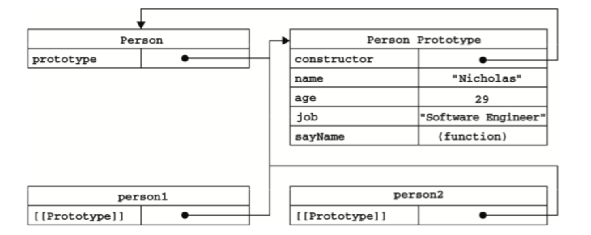
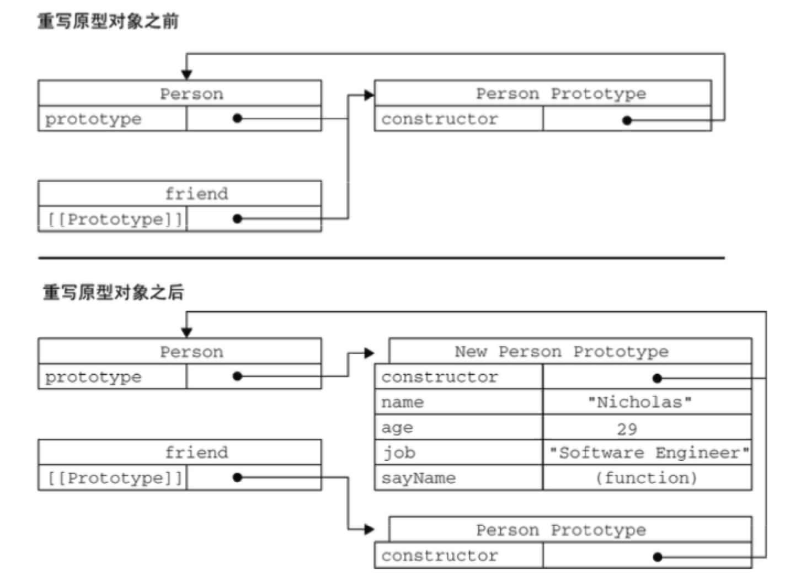
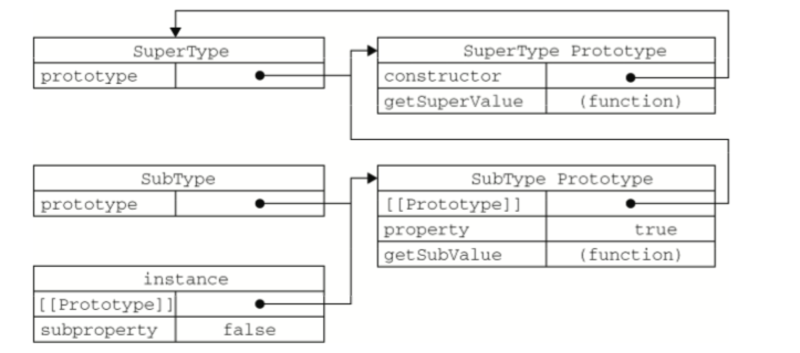
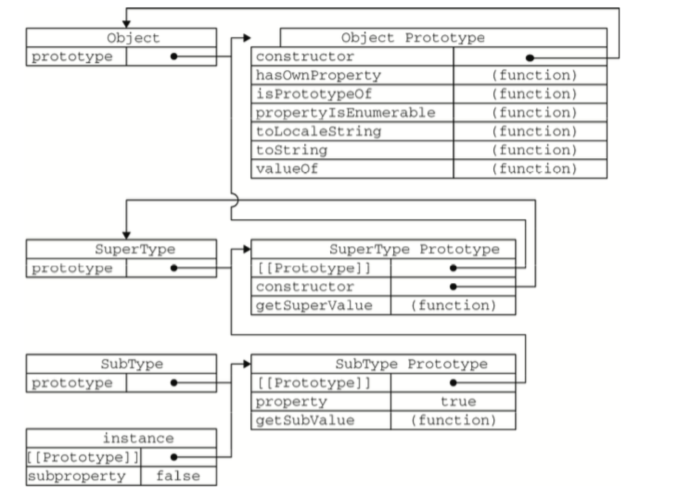

## 属性类型
### 数据属性
数据属性有4个描述其行为的特性：
* [[Configurable]]: 表示能否通过delete删除属性，能否修改属性特性，能否把属性改为访问器属性。
* [[Enumerable]]: 表示能否通过for-in枚举。
* [[Writable]]: 表示能否修改属性的值。
* [[Value]]: 表示这个属性的值。

直接在对象上定义的属性，[[Configurable]]、[[Enumerable]]、[[Writable]]默认都是true。

<!--more-->

#### Object.defineProperty(): 修改属性的特性
```
var person = {};
Object.defineProperty(person, "name", {
  writable: false,
  value: "Nicholas"
});
alert(person.name); // "Nicholas"
person.name = "Greg";
alert(person.name); // "Nicholas"
```

**注意：一旦把属性设置为不可配置，就再不能把它变为可配置了。**

### 访问器属性
访问器属性不包含数据值，包含一对getter和setter函数。
访问器属性有以下4个特性：
* [[Configurable]]: 表示能否通过delete删除属性，能否修改属性特性，能否把属性改为数据属性。
* [[Enumerable]]: 表示能否通过for-in枚举。
* [[Get]]: 读取属性时调用的函数，默认undefined。
* [[Set]]: 在写入属性时调用的函数，默认undefined。

**访问器属性不能直接定义，必须使用Object.defineProperty()来定义。**
```
var book = {
  _year: 2004,
  edition: 1
};

Object.defineProperty(book, "year", {
  get: function () {
    return this._year;
  },
  set: function (newV) {
    if (newV > 2004) {
      this._year = newV;
      this.edition += newV - 2004;
    }
  }
});

book.year = 2005;
alert(book.edition); // 2
```

#### Object.defineProperties(): 定义多个属性
```
var book = {};

Object.defineProperties(book, {
  _year: {
    value: 2004
  },
  edition: {
    value: 1
  },
  year: {
    get: function () {
      return this._year;
    },
    set: function (newV) {
      if (newV > 2004) {
        this._year = newV;
        this.edition += newV - 2004;
      }
    }
  }
})
```

#### Object.getOwnPropertyDescriptor(): 读取属性的特性
```
var descriptor = Object.getOwnPropertyDescriptor(book, "_year"); // book是对象，_year是属性名
```

## 创建对象
### 工厂模式
```
function createPerson (name, age, job) {
  var o = new Object();
  o.name = name;
  o.age = age;
  o.job = job;
  o.sayName = function () {
    alert(this.name);
  };
  return o;
}
```
### 构造函数模式
```
function Person (name, age, job) {
  this.name = name;
  this.age = age;
  this.job = job;
  this.sayName = function () {
    alert(this.name);
  };
}

var person1 = new Person("Nicholas", 29, "Software Engineer");
```
### 原型模式
在构造函数原型对象上添加的属性和方法是所有构造函数生成实例所共享的。
```
function Person () {}

Person.prototype.name = "Nicholas";
Person.prototype.age = 29;
Person.prototype.job = "Software Engineer";
Person.prototype.sayName = function () {
  alert(this.name);
};
```
**构造函数与原型之间的关系如下：**
<div style="clear: both;"></div>

<div style="clear: both;"></div>

* isPrototypeOf(): 判断原型
```
Person.prototype.isPrototypeOf(person1); // true
```
* Object.getPrototypeOf(): 获取原型

**注意：虽然可以通过对象实例访问原型中的值，但却不能通过对象实例重写原型中的值；如果对象实例有一个和原型属性同名的属性，那么该属性会屏蔽原型中的属性。**
```
function Person () {}

Person.prototype.name = "Nicholas";

var person1 = new Person();
var person2 = new Person();

person1.name = "Greg";
alert(person1.name); // "Greg"--实例属性值
alert(person2.name); // "Nicholas"--原型属性值

delete person1.name; // delete可以删除实例属性
alert(person1.name); // "Nicholas"--原型属性值
```

**使用hasOwnProperty()方法可以判断一个属性是在实例中还是原型中，在实例中返回true。**
```
person1.hasOwnProperty("name");
```

#### 原型与in操作符
* 单独使用in，对象能否访问给定属性时返回true，无论是实例属性还是原型属性。
```
alert("name" in person1); // true
```
* for-in会返回所有能通过对象访问的、可枚举的属性。（包括实例和原型属性）

#### Object.keys(): 如果通过实例调用，只返回实例的属性。
#### Object.getOwnPropertyNames(): 可以返回所有属性，无论是否可枚举。
#### 更简便的原型语法
```
function Person () {}

Person.prototype = {
  name: "Nicholas",
  age: 29,
  job: "Software Engineer",
  sayName: function () {
    alert(this.name);
  }
}

// 确保constructor不被改变
Object.defineProperty(Person.prototype, "constructor", {
  enumerable: false,
  value: Person
})
```

**注意：尽管可以随时为原型添加属性和方法，如果是重写整个原型对象，把原型修改为另外一个对象等同于切断了构造函数与最初原型对象的联系，而实例的指针仅指向原型不指向构造函数**
```
function Person () {}

var friend = new Person();

Person.prototype = {
  name: "Nicholas",
  age: 29,
  job: "Software Engineer",
  sayName: function () {
    alert(this.name);
  }
}

friend.sayName(); // error
```
**发生错误的原因如下图所示：**  
<div style="clear: both;"></div>

<div style="clear: both;"></div>

### 构造函数与原型组合模式
**使用最广泛、认同度最高的一种模式**
```
function  Person (name, age, job) {
  this.name = name;
  this.age = age;
  this.job = job;
  this.friends = ["Shelby", "Court"];
}

Person.prototype = {
  constructor: Person,
  sayName: function () {
    alert(this.name);
  }
};

var person1 = new Person("Nicholas", 29, "Software Engineer");
var person2 = new Person("Greg", 27, "Doctor");

person1.friends.push("Van");
alert(person1.friends);  "Shelby, Court, Van"
alert(person2.friends);  "Shelby, Court"
```
### 动态原型模式
动态为原型添加属性、方法
```
function  Person (name, age, job) {
  this.name = name;
  this.age = age;
  this.job = job;
  this.friends = ["Shelby", "Court"];
  if (typeof this.sayName !== "function") {
    Person.prototype.sayName = function () {
      alert(this.name);
    };
  }
}

```

### 寄生构造函数模式
**注意：寄生构造函数返回的对象与构造函数或者构造函数的原型没有关系，不能依赖instanceof来确定对象类型（不推荐使用这个模式）**
```
function Person (name, age, job) {
  var o = new Object();
  o.name = name;
  o.age = age;
  o.job = job;
  return 0;
}

var friend = new Person("Nicholas", 29, "Software Engineer");
```
### 稳妥构造函数模式
**适用于安全的环境中(禁止使用this和new)**
```
function Person (name, age, job) {
  var o = new Object();
  o.sayName = function () {
    alert(name);
  }
  return 0;
}

var friend = Person("Nicholas", 29, "Software Engineer"); // 不使用new操作符
friend.sayName(); // "Nicholas"
```

## 继承
ECMAScript 只支持实现继承，依靠原型链来实现。

### 原型链
将子类的原型对象重新指向父类的实例，则子类实例可以访问所有父类的属性、方法。

```
function SuperType () {
  this.property = true;
}

SuperType.prototype.getSuperValue = function () {
  return this.property;
};

function SubType () {
  this.subproperty = false;
}

SubType.prototype = new SuperType();

SubType.prototype.getSubValue = function () {
  return this.subproperty;
};

var instance = new SubType();
alert(instance.getSuperValue()); // true
```
上面示例对应关系如下图：
<div style="clear: both;"></div>

<div style="clear: both;"></div>

**通过原型链实现的继承，搜索某个属性、方法的过程是沿着原型链向上搜索**
1. 搜索子类实例；
2. 搜索子类原型；
3. 搜索父类实例；
4. 搜索父类的原型；

#### 默认的原型
所有的函数默认的原型都是Object的实例，因此上面示例完整的关系如下所示：
<div style="clear: both;"></div>

<div style="clear: both;"></div>

#### 确定原型和实例的关系
* instanceof：
只要是该实例原型链中出现过的构造函数，都会返回true。
```
alert(instance of Object); // true
```
* isPrototypeOf()：
只要是该实例原型链中出现过的原型，也都会返回true。
```
alert(Object.prototype.isPrototypeOf(instance)); // true
```

#### 谨慎定义方法
子类需要重写超类的某个方法，或者添加方法时，**必须要放在替换子类原型语句之后, 不能使用对象字面量方式来为原型定义方法属性（会导致重写原型，和超类的原型链被切断）**。
```
function SuperType () {
  this.property = true;
}

SuperType.prototype.getSuperValue = function () {
  return this.property;
};

function SubType () {
  this.subproperty = false;
}

SubType.prototype = new SuperType();
SubType.prototype.getSuperValue = function () {
  return false;
}
```

#### 单独使用原型链实现继承所产生的问题
* 因为子类的原型指向父类的实例，所有父类实例属性会变成子类原型属性被子类实例所共享。
* 创建子类实例时无法向父类构造函数传参。

### 借用构造函数
基本思想：在子类构造函数内部调用父类构造函数。
```
function SuperType () {
  this.colors = ["red", "blue", "green"];
}

function SubType () {
  SuperType.call(this);
}

var instance1 = new SubType();
instance1.colors.push("black");
alert(instance1.colors); // "red , blue, green, black"

var instance2 = new SubType();
alert(instance2.colors); // "red , blue, green"
```

### 组合继承
组合了原型链和借用构造函数的继承方式。组合继承避免了原型链和借用构造函数的缺陷，融合了它们的优点，成为最常用的继承模式。
```
function SuperType (name) {
  this.name = name;
  this.colors = ["red", "blue", "green"];
}

SuperType.prototype.sayName = function () {
  alert(this.name);
};

function SubType (name, age) {
  SuperType.call(this, name);
  this.age = age;
}

SubType.prototype = new SuperType();
SubType.prototype.constructor = SubType;
SubType.prototype.sayAge = function () {
 alert(this.age);
};

var instance1 = new SubType("Nicholas", 29);
instance1.colors.push("black");
alert(instance1.colors); // "red , blue, green, black"
alert(instance1.sayName); // "Nicholas"

var instance2 = new SubType("Greg", 27);
alert(instance2.colors); // "red , blue, green"
alert(instance2.sayName); // "Greg"
```

### 原型式继承
通过Object.create()来实现，接收两个参数：1.用作新对象原型的对象，2（可选）为新对象定义额外属性的对象。
```
var person = {
  name: "Nicholas",
  friends: ["Shelby", "Court", "Van"]
};

var anotherPerson = Object.create(person, {
  name: {
    value: "Greg"
  }
})

alert(anotherPerson.name); // "Greg"
```
**注意：作为原型的对象上的属性方法都是共享的**

### 寄生式继承
基本思想：和寄生构造函数和工厂模式类似，创建一个仅用于封装继承过程的函数，在内部以某种方式增强对象，最后再返回对象。

### 寄生组合式继承
组合继承是最常用的继承模式，不过也有不足：无论在什么情况下都会调用两次超类的构造函数（一次是在创建子类原型时，第二次是在子类构造函数内部）。
**开发人员普遍认为寄生组合式继承是引用类型最理想的继承方法。**
```
function inheritPrototype (SubType, SuperType) {
  var prototype = Object.create(SuperType.prototype);
  prototype.constructor = SubType;
  SubType.prototype = prototype;
}
```
