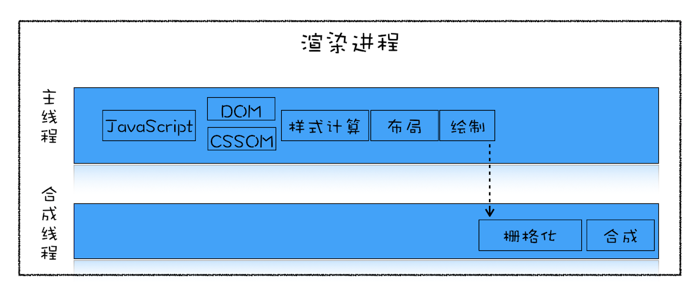

### 页面加载阶段

**页面加载阶段：是指从发出请求到渲染出完整页面的过程，影响到这个阶段的主要因素有网络和 JavaScript 脚本。**

#### 一个典型的页面渲染流水线：

<!--more-->

并非所有的资源都会阻塞页面的首次绘制，比如图片、音频、视频等文件就不会阻塞页面的首次渲染；而 JavaScript、首次请求的 HTML 资源文件、CSS 文件是会阻塞首次渲染的，因为在构建 DOM 的过程中需要 HTML 和 JavaScript 文件，在构造渲染树的过程中需要用到 CSS 文件。
我们把这些能阻塞网页首次渲染的资源称为**关键资源**。

#### 基于关键资源，我们可以继续细化出来三个影响页面首次渲染的核心因素
* 关键资源个数：关键资源个数越多，首次页面的加载时间就会越长。比如上图中的关键资源个数就是 3 个，1 个 HTML 文件、1 个 JavaScript 和 1 个 CSS 文件；
* 关键资源大小：通常情况下，所有关键资源的内容越小，其整个资源的下载时间也就越短，那么阻塞渲染的时间也就越短。上图中关键资源的大小分别是 6KB、8KB 和 9KB，那么整个关键资源大小就是 23KB；
* 请求关键资源需要多少个 RTT（Round Trip Time）：RTT 是指单个数据包的往返时延。它是网络中一个重要的性能指标，表示从发送端发送数据开始，到发送端收到来自接收端的确认，总共经历的时延。通常 1 个 HTTP 的数据包在 14KB 左右，所以 1 个 0.1M 的页面就需要拆分成 8 个包来传输了，也就是说需要 8 个 RTT；

（注意：关于 JavaScript 和 CSS 文件，这里需要注意一点，由于渲染引擎有一个预解析的线程，在接收到 HTML 数据之后，预解析线程会快速扫描 HTML 数据中的关键资源，一旦扫描到了，会立马发起请求，你可以认为 JavaScript 和 CSS 是同时发起请求的，所以它们的请求是重叠的，那么计算它们的 RTT 时，只需要计算体积最大的那个数据就可以了。）

#### 针对核心因素的优化方案
* 如何减少关键资源的个数？一种方式是可以将 JavaScript 和 CSS 改成内联的形式，比如上图的 JavaScript 和 CSS，若都改成内联模式，那么关键资源的个数就由 3 个减少到了 1 个。另一种方式，如果 JavaScript 代码没有 DOM 或者 CSSOM 的操作，则可以改成 async 或者 defer 属性；同样对于 CSS，如果不是在构建页面之前加载的，则可以添加媒体取消阻止显现的标志。当 JavaScript 标签加上了 async 或者 defer、CSSlink 属性之前加上了取消阻止显现的标志后，它们就变成了非关键资源了；
* 如何减少关键资源的大小？可以压缩 CSS 和 JavaScript 资源，移除 HTML、CSS、JavaScript 文件中一些注释内容；
* 如何减少关键资源 RTT 的次数？可以通过减少关键资源的个数和减少关键资源的大小搭配来实现。除此之外，还可以使用 CDN 来减少每次 RTT 时长；

--------------------------------

### 页面交互阶段

**页面交互阶段：是指从页面加载完成到用户交互的整合过程，影响到这个阶段的主要因素是 JavaScript 脚本。**

谈交互阶段的优化，其实就是在谈渲染进程渲染帧的速度，因为在交互阶段，帧的渲染速度决定了交互的流畅度。因此讨论页面优化实际上就是讨论渲染引擎是如何渲染帧的，否则就无法优化帧率。

#### 交互阶段的渲染流水线：

* **重排**：如果在计算样式阶段发现有布局信息的修改，那么就会触发重排操作，然后触发后续渲染流水线的一系列操作，这个代价是非常大的；
* **重绘**：同样如果在计算样式阶段没有发现有布局信息的修改，只是修改了颜色一类的信息，那么就不会涉及到布局相关的调整，所以可以跳过布局阶段，直接进入绘制阶段，这个过程叫重绘。不过重绘阶段的代价也是不小的；
* **合成**：还有另外一种情况，通过 CSS 实现一些变形、渐变、动画等特效，这是由 CSS 触发的，并且是在合成线程上执行的，这个过程称为合成。因为它不会触发重排或者重绘，而且合成操作本身的速度就非常快，所以执行合成是效率最高的方式；

#### 交互阶段的优化方案
* 减少 JavaScript 脚本执行时间：
  1. 方法一：将一次执行的函数分解为多个任务，使得每次的执行时间不要过久；
  2. 方法二：采用 Web Workers。你可以把 Web Workers 当作主线程之外的一个线程，在 Web Workers 中是可以执行 JavaScript 脚本的，不过 Web Workers 中没有 DOM、CSSOM 环境，这意味着在 Web Workers 中是无法通过 JavaScript 来访问 DOM 的，所以我们可以把一些和 DOM 操作无关且耗时的任务放到 Web Workers 中去执行；
* 避免强制同步布局：
所谓强制同步布局，是指修改dom布局信息后立即通过JavaScript获取dom布局信息，强制将计算样式和布局操作提前到当前的任务中。
* 避免布局抖动：
还有一种比强制同步布局更坏的情况，那就是布局抖动。所谓布局抖动，是指在一次 JavaScript 执行过程中，多次执行强制布局和抖动操作。
* 合理利用 CSS 合成动画：
合成动画是直接在合成线程上执行的，这和在主线程上执行的布局、绘制等操作不同，如果主线程被 JavaScript 或者一些布局任务占用，CSS 动画依然能继续执行。所以要尽量利用好 CSS 合成动画，如果能让 CSS 处理动画，就尽量交给 CSS 来操作。
另外，如果能提前知道对某个元素执行动画操作，那就最好将其标记为 **will-change**，这是告诉渲染引擎需要将该元素单独生成一个图层。
* 避免频繁的垃圾回收：
由于 JavaScript 使用了自动垃圾回收机制，如果在一些函数中频繁创建临时对象，那么垃圾回收器也会频繁地去执行垃圾回收策略。这样当垃圾回收操作发生时，就会占用主线程，从而影响到其他任务的执行，严重的话还会让用户产生掉帧、不流畅的感觉。