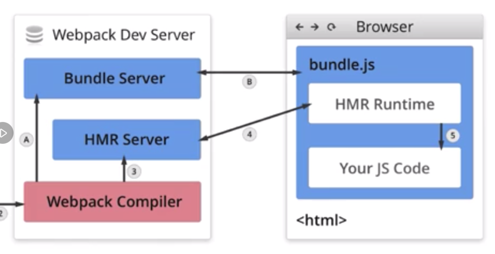

## 核心配置：entry、output

entry指定入口文件，output指定输出位置和文件名

### 单入口
entry是一个字符串

output配置如下：
```
module.exports = {
  output: {
    filename: 'bundle.js',
    path: __dirname + '/dist'
  }
}
```

<!--more-->

### 多入口

entry是一个对象，配置如下：
```
module.exports = {
  entry: {
    app: './src/app.js',
    adminApp: './src/adminApp.js'
  }
}
```
output配置如下：
```
module.exports = {
  output: {
    filename: '[name].js', // 通过占位符确保文件名称唯一
    path: __dirname + '/dist'
  }
}
```
----------------------------------

## 核心配置：loaders

webpack开箱即用只支持js和json两种文件类型，通过loaders支持其他类型文件的转换。

loader本身是一个函数，接受源文件作为参数，返回转换结果。

### 常用的loader

* babel-loader：转换es6、es7等js新特性语法；
* css-loader：支持.css文件的加载和解析；
* less-loader：将less文件转换成css；
* ts-loader：将ts转换成js；
* file-loader：对图片、字体进行打包；
* raw-loader：将文件以字符串形式导入；
* thread-loader：多进程打包js和css。

### loader的用法
test：指定匹配规则
use：指定使用的loader
```
module.exports = {
  module: {
    rules: [
      { test: /\.txt$/, use: 'raw-loader' }
    ]
  }
}
```
----------------------------------

## 核心配置：plugins

plugins用于对bundle文件进行优化、资源管理、环境变量注入等，作用于整个构建过程。

### 常用的plugins

* CommonsChunkPlugin：将chunks相同的模块代码提取成公共js；
* CleanWebpackPlugin：清理构建目录；
* ExtractTextWebpackPlugin：将css从bundle文件里提取成独立的css文件；
* CopyWebpackPlugin：将文件或文件夹拷贝到构建的输出目录；
* HtmlWebpackPlugin：创建html文件去承载输出的bundle；
* UglifyjsWebpackPlugin：压缩js；
* ZipWebpackPlugin：将打包出的资源生成一个zip包。

### plugin的用法

```
module.exports = {
  plugins: [
    new HtmlWebpackPlugin({
      template: './src/index.html'
    })
  ]
}
```

----------------------------------

## 核心配置：mode

mode用来指定当前构建环境：production、development。（webpack4新增）

这是mode后可以使用webpack内置的函数，默认为：production

### mode内置函数功能
* development：设置process.env.NODE_ENV的值为development，开启NamedChunksPlugin和NamedModulesPlugin。
* production：设置process.env.NODE_ENV的值为production，开启FlagDependencyUsagePlugin、FlagIncludedChunksPlugin、ModuleConcatenationPlugin、NoEmitOnErrorsPlugin、OccurrenceOrderPlugin、SideEffectsFlagPlugin、TerserPlugin。

----------------------------------

## 解析ES6

### 使用babel-loader
```
module.exports = {
  module: {
    rules: [
      {
        test: /.js$/,
        use: 'babel-loader'
      }
    ]
  }
}
```

### babel的配置文件：.babelrc：
* presets： 一系列plugin的集合
* plugins：一个插件对应一个功能
```
增加ES6的preset配置
{
  "presets": [
    "@babel/preset-env" // 一系列plugin的集合
  ]
}
```

### 安装babel
```
npm i -D @babel/core @babel/preset-env babel-loader
```

----------------------------------

## 解析react jsx

### babel新增配置：

```
{
  "presets": [
    "@babel/preset-env",
    "@babel/preset-react"
  ]
}
```

**vscode快捷键：“!” 加 “tab”：快速生成html模板**

----------------------------------

## 解析css
css-loader：用于加载.css文件，并且转换成commonjs对象；
style-loader：用于将样式用过style标签插入到head中。

### 安装css-loader、style-loader
```
npm i -D style-loader css-loader
```

### css相关loader的webpack配置

**注意：loader是从右至左（和书写方向相反）链式调用的**
```
module.exports = {
  module: {
    rules: [
      {
        test: /.js$/,
        use: 'babel-loader'
      },
      {
        test: /.css$/,
        use: [
          'style-loader', // 后执行
          'css-loader' // 先执行
        ]
      }
    ]
  }
}
```

----------------------------------

## 解析less

less-loader 用于将less转换成css

### 安装less的loader
```
npm i less less-loader -D
```

### less相关loader的webpack配置

```
module.exports = {
  module: {
    rules: [
      {
        test: /.less$/,
        use: [
          'style-loader', // 后执行
          'css-loader',
          'less-loader' // 先执行
        ]
      }
    ]
  }
}
```

----------------------------------

## 解析图片和字体

### 方法一：使用file-loader
file-loader用于处理文件（图片、字体）

#### 安装file-loader
```
npm i file-loader -D
```

#### file-loader的webpack配置 

```
module.exports = {
  module: {
    rules: [
      // 图片
      {
        test: /.(png|jpg|gif|jpeg)$/,
        use: 'file-loader'
      },
      // 字体
      {
        test: /.(woff|woff2|eot|ttf|otf)$/,
        use: 'file-loader'
      }
    ]
  }
}
```

### 方法二：使用url-loader
url-loader也可以处理图片、字体，可以设置较小资源自动 base64

#### 安装url-loader
```
npm i url-loader -D
```

#### url-loader的webpack配置 

```
module.exports = {
  module: {
    rules: [
      // 图片
      {
        test: /.(png|jpg|gif|jpeg)$/,
        use: [
          {
            loader: 'url-loader',
            options: {
              limit: 10240 // Byte（字节）= 10KB
            }
          }
        ]
      }
    ]
  }
}
```

----------------------------------

## 文件监听

文件监听是指源码发生变化时，自动重新构建出的新的输出文件。
原理：webpack轮询判断文件最后编辑时间是否变化，如果发生了变化，并不会立刻告诉监听者，而是先缓存起来，等待timeout。

有两种方式开启监听模式：
* 启动webpack命令时，带上 “--watch” 参数；
* 配置webpack.config.js时，设置watch: true。（默认：false）

监听配置：webpack.config.js
```
module.exports = {
  watch: true,
  watchOptions: {
    ignored: /node_modules/,
    aggregateTimeout: 300, // 监听到变化后会等待300ms再执行
    poll: 1000 // 轮询频率：每秒1000次
  }
}
```

使用方式：package.json
```
{
  "name": "hello-webpack",
  "version": "1.0.0",
  ...,
  "scripts": {
    "watch": "webpack --watch"
  }
  ...
}
```

启动
```
npm run watch
```

**缺陷： 每次需要手动刷新浏览器**

----------------------------------

## 热更新

### 方法一：webpack-dev-server
 
#### 特点：
* 不刷新浏览器
* 不输出文件，而是放在内存中（没有硬盘IO,速度快）
* 结合使用HotModuleReplacementPlugin插件

#### 安装webpack-dev-server
```
npm i webpack-dev-server -D
```

#### 运行，配置：package.json
```
{
  "scripts": {
    "dev": "webpack-dev-server --open" // --open指构建完成，自动开启浏览器
  }
}
```

#### 配置：webpack.config.js
```
module.exports = {
  mode: 'development', // 开发环境才启用
  devServer: {
    contentBase: './dist', // devServer的基础目录
    hot: true // 开启热更新
  }
}
```

### 方法二：webpack-dev-middleware

WDM将webpack的输出文件传输给服务器，适用于灵活的定制场景。（需要自己启动一个服务器）

### 热更新原理分析：

* Webpack Compiler：将js编译成bundle.js；
* HMR Server：将热更新文件输出给HMR Runtime；（将变化通知HMR Runtime）
* HMR Runtime：会被注入到浏览器，更新文件变化；(在bundle.js和服务器之间建立web socket连接，监听变化，更新文件)
* Bundle Server：提供文件在浏览器的访问；


<div style="clear: both"></div>

----------------------------------

## 文件指纹

**文件指纹指的是打包后输出的文件名后缀， 通常用来进行版本管理**

文件指纹的生成方式：
* Hash：和整个项目的构建相关，只要项目文件有修改，整个项目所有的hash值就会更改；
* ChunkHash：和打包的chunk有关，不同entry会生成不同的chunkhash值；（适用js文件）
* ContentHash：根据文件内容定义hash，文件内容不变，则contenthash不变。（适用css文件）

### js文件指纹设置
设置output的filename，使用'chunkhash'，在webpack.config.js：
```
module.exports = {
  output: {
    filename: '[name][chunkhash:8].js',
    path: __dirname + '/dist'
  }
}
```

### css文件指纹设置
通常style-loader会将css添加在html文件的head里，并没有单独的css文件；
如果要单独提取css文件，需要将style-loader替换成MiniCssExtractPlugin.loader；
设置MiniCssExtractPlugin的filename，使用'contenthash'，在webpack.config.js：
```
module.exports = {
  plugins: [
    new MiniCssExtractPlugin({
      filename: '[name][contenthash:8].css'
    })
  ]
}
```

### 图片、字体文件指纹设置
设置file-loader的name，使用'hash'，在webpack.config.js：
```
module.exports = {
  module: {
    rules: [
      {
        test: /\.(png|svg|jpg|gif)$/,
        use: [
          {
            loader: 'file-loader',
            options: {
              name: 'img/[name][hash:8].[ext]'
            }
          }
        ]
      }
    ]
  }
}
```

### 占位符含义：
```
[ext]：资源后缀名
[name]：文件名
[path]：文件相对路径
[folder]：文件所在文件夹
[contenthash]：文件内容的hash,默认md5生成（32位）
[hash]：项目整体文件内容的hash,默认md5生成
[emoji]：一个随机的指代文件内容的emoji
```

----------------------------------

## 代码压缩

### js压缩
**webpack4内置uglifyjs-webpack-plugin，无需手动操作。**

### css压缩
**使用optimize-css-assets-webpack-plugin，同时使用 cssnano。**

安装optimize-css-assets-webpack-plugin、cssnano
```
npm i -D optimize-css-assets-webpack-plugin cssnano
```

webpack.config.js配置：
```
module.exports = {
  plugins: [
    new OptimizeCSSAssetsPlugin({
      assetNameRegExp: /\.css$/g,
      cssProcessor: require('cssnano')
    })
  ]
}
```

### html压缩
**通过设置html-webpack-plugin压缩参数。（注意：一个页面对应一个html-webpack-plugin）**

安装html-webpack-plugin
```
npm i html-webpack-plugin -D
```

webpack.config.js配置：
```
module.exports = {
  plugins: [
    new HtmlWebpackPlugin({
      template: path.join(__dirname, 'src/search.html'), // 模板
      filename: 'search.html', // 打包后名称
      chunks: ['search'], // 生成html需要使用的chunk
      inject: true, // 打包后的chunkjs会自动注入到html里
      minify: {
        html5: true,
        collapseWhitespace: true,
        preserveLineBreaks: false,
        minifyCSS: true,
        minifyJS: true,
        removeComments: false
      }
    })
  ]
}
```

