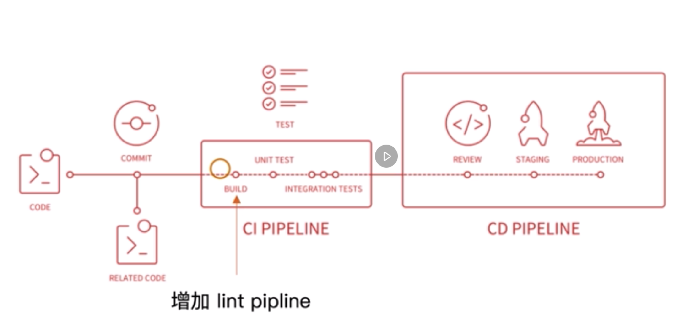
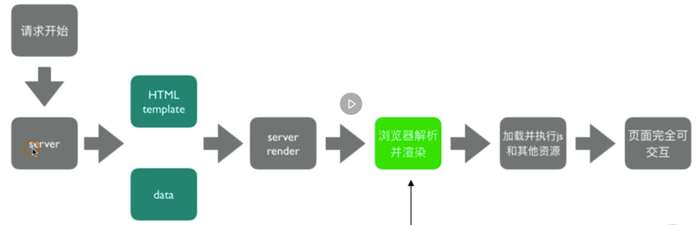

## 自动清理构建目录

### 方法一：通过npm scripts清理构建目录
```
rm -rf ./dist && webpack
```

### 方法二：使用clean-webpack-plugin
**默认会删除output指定的输出目录**

安装clean-webpack-plugin
```
npm i -D clean-webpack-plugin
```

<!--more-->

webpack.config.js配置：
```
module.exports = {
  plugins: [
    new CleanWebpackPlugin()
  ]
}
```

-----------------------------------------
 
## 自动补齐CSS3前缀

**使用postcss-loader和autoprefixer插件：打包css后置处理器**

安装插件
```
npm i postcss-loader autoprefixer -D
```

webpack.config.js配置：
```
module.exports = {
  module: {
    rules: [
      {
        test: /.less$/,
        use: [
          MiniCssExtractPlugin.loader, // 后执行
          'css-loader',
          'less-loader', // 先执行
          {
            loader: 'postcss-loader',
            options: {
              plugins: () => [
                require('autoprefixer')({
                  // last 2 version：最近两个版本，>1%：指浏览器使用人数占比，ios 7：ios7以上版本
                  browsers: ['last 2 version', '>1%', 'ios 7']
                })
              ]
            }
          }
        ]
      }
    ]
  }
}
```

-----------------------------------------
 
## px自动转换成rem

* rem：font-size of the root element
* rem是相对单位，px是绝对单位

**使用px2rem-loader，在页面渲染时动态计算根元素font-size值。（成熟方案：手淘的lib-flexible库）**

安装px2rem-loader、lib-flexible：
```
npm i px2rem-loader -D
npm i lib-flexible -S
```

webpack.config.js配置：
```
module.exports = {
  module: {
    rules: [
      {
        test: /.less$/,
        use: [
          MiniCssExtractPlugin.loader, // 后执行
          'css-loader',
          'less-loader', // 先执行
          {
            loader: 'postcss-loader',
            options: {
              plugins: () => [
                require('autoprefixer')({
                  // last 2 version：最近两个版本，>1%：指浏览器使用人数占比，ios 7：ios7以上版本
                  browsers: ['last 2 version', '>1%', 'ios 7']
                })
              ]
            }
          },
          {
            loader: 'px2rem-loader',
            options: {
              remUnit: 75, // 表示1rem = 75px， 视觉稿750px
              remPrecision: 8 // 保留小数点的位数
            }
          }
        ]
      }
    ]
  }
}
```

**注意：需要在head引入lib-flexible动态计算font-size**

-----------------------------------------
 
## 静态资源内联至html

资源内联的意义：
* 减少http请求（小图片或字体：url-loader）；
* 页面框架初始化脚本；
* 上报埋点脚本；
* css内联避免页面闪动；

## html和js内联

使用raw-loader
* 内联html片段（例如移动端meta片段）
* 内联js脚本（例如lib-flexible）

安装raw-loader
```
npm i raw-loader@0.5.1 -D
```

在html内：
```
<head>
  ${ require('raw-loader!./meta.html') }
  <title>Document</title>
  <script>${ require('raw-loader!babel-loader!../../node_modules/lib-flexible/flexible.js') }</script>
</head>
```
**注意：如果js语法使用了es6或更新的语法需要使用babel-loader**

## css内联

### 方法一：借助style-loader
```
module.exports = {
  module: {
    rules: [
      {
        test: /\.scss$/,
        use: [
          {
            loader: 'style-loader',
            options: {
              insertAt: 'top', // 样式插入到head
              singleton: true // 将所有style标签合成一个
            }
          },
          'css-loader',
          'sass-loader'
        ]
      }
    ]
  }
}
```

### 方法二：html-inline-css-webpack-plugin

将打包好的css文件插入到html对应的位置

-----------------------------------------
 
## 多页面应用打包

基本思路：每个页面对应一个entry和一个html-webpack-plugin
缺点：每次新增或删除页面需要修改webpack配置

**优化方案：动态获取entry，设置html-webpack-plugin数量（使用glob.sync库）**

安装glob
```
npm i -D glob
```

配置webpack.config.js
```
const glob = require('glob');

const setMPA = () => {
  const entry = {};
  const htmlWebpackPlugins = [];

  const entryFiles = glob.sync(path.join(__dirname, './src/*/index.js'));

  entryFiles.map((file) => {
    const pageName = file.replace(/.*\/src\/(.*)\/index.js/, '$1');
    entry[pageName] = file;
    htmlWebpackPlugins.push(
      new HtmlWebpackPlugin({
        template: path.join(__dirname, `src/${pageName}/search.html`),
        filename: `${pageName}.html`,
        chunks: [pageName],
        inject: true,
        minify: {
          html5: true,
          collapseWhitespace: true,
          preserveLineBreaks: false,
          minifyCSS: true,
          minifyJS: true,
          removeComments: false
        }
      })
    )
  })
  
  return {
    entry,
    htmlWebpackPlugins
  }
}

const { entry, htmlWebpackPlugins } = setMPA();

module.exports = {
  entry: entry,
  plugins: [
    ...
  ].concat(htmlWebpackPlugins)
}
```

-----------------------------------------
 
## 使用source map定位源代码

* 开发环境开启（可在chrome控制台看到源代码），线上环境关闭；
* 线上排查问题时可以将source map上传到错误监控系统。

### source map关键字
通过关键字组合得到不同类型source map

* eval：使用eval包裹模块代码；
* source map：产生.map文件；
* cheap：不包含列信息；
* inline：将.map文件作为DataURI嵌入，不单独生成.map文件；
* module：包含loader的source map。 

开启source map配置（webpack.dev.js）：
```
module.exports = {
  devtool: 'source-map'
}
```

-----------------------------------------
 
## 提取页面公共资源

### 基础库分离

#### 方法一：使用html-webpack-externals-plugin
思路：将react、react-dom通过cdn引入，不打入bundle中

webpack.config.js配置：
```
const HtmlWebpackExternalsPlugin = require('html-webpack-externals-plugin);

module.exports = {
  plugins: [
    ...,
    new HtmlWebpackExternalsPlugin({
      externals: [
        {
          module: 'react',
          entry: 'cdn的url',
          global: 'React'
        },
        {
          module: 'react-dom',
          entry: 'cdn的url',
          global: 'ReactDOM'
        }
      ]
    })
    ,,,
  ]
}
```

#### 方法二：使用split-chunks-plugin

webpack4内置，用于替代commons-chunk-plugin插件

**1. 分离基础包配置：**
```
module.exports = {
  optimization: {
    splitChunks: {
      cacheGroups: {
        commons: {
          test: /(react|react-dom)/,
          name: 'vendors', // 抽离后的文件名
          chunks: 'all' 
        }
      }
    }
  }
}
```
chunks参数说明：
* async：异步引入的库进行分离（默认）；
* initial：同步引入的库进行分离；
* all：所有引入的库进行分离（推荐）。

**2. 分离页面公共文件配置：**
```
module.exports = {
  optimization: {
    splitChunks: {
      minSize: 0,
      cacheGroups: {
        commons: {
          name: 'commons',
          chunks: 'all',
          minChunks: 2 
        }
      }
    }
  }
}
```
参数说明：
* minChunks：设置最小引用次数；
* minSize：需要分离的源文件体积大小最小尺寸, 为0表示只要有引用就分离；

**注入以上分离的包，需要配置htmlWebpackPlugins，引入vendors、commons：**
```
htmlWebpackPlugins.push(
  new HtmlWebpackPlugin({
    template: path.join(__dirname, `src/${pageName}/index.html`),
    filename: `${pageName}.html`,
    chunks: ['vendors', 'commons', pageName],
    inject: true,
    minify: {
      html5: true,
      collapseWhitespace: true,
      preserveLineBreaks: false,
      minifyCSS: true,
      minifyJS: true,
      removeComments: false
    }
  })
)
```

-----------------------------------------
 
## Tree Shaking的使用和分析

**概念：**
1个模块可能有多个方法，一般情况下只要某个方法使用到了，整个模块都会被打包到bundle里，tree shaking的作用就是把使用到的方法打入bundle，没有用到的会在uglify阶段被擦除掉。

**使用方式**
注意：必须是es6语法，commonjs的方式不支持。
* webpack4默认支持，在.babelrc里设置modules: false即可。
* 在production模式下默认开启


### 原理分析

#### DCE（dead code elimination)
* 代码不会被执行，不可到达；
* 代码执行结果不会被用到；
* 代码只会影响死变量（只写不读）；

**例如：**
```
if (false) {
  console.log('这段代码永远不会执行');
}
```

#### 利用ES6模块特点
* 只能作为模块顶层语句出现；
* import的模块名只能是字符串常量（非动态）；
* import的模块是不可修改的。 

**基于以上原理webpack会在编译阶段静态分析代码，对无用代码进行标记，在uglify阶段擦除。**

-----------------------------------------
 
## Scope Hoisting的使用

### 打包存在的问题：
* 一个模块一个闭包，大量函数闭包包裹代码会导致体积增大；
* 运行代码时创建的函数作用域变多，导致内存开销变大。

### 模块转换分析

* webpack会在转换后的模块外加上一层包裹；
* import会被转换成__webpack_require；
* 打包后是一个IIFE（匿名闭包）；
* modules是一个数组，每一项是一个模块初始化函数；
* __webpack_require用来加载模块，返回module.exports；
* 通过WEBPACK_REQUIRE_METHOD(0)启动程序。

### scope hoisting原理
将所有模块的代码按照引用顺序放在一个函数作用域里，然后对变量进行重命名以防止发生命名冲突。

**作用：通过scope hoisting可以减少函数声明代码和内存开销。**

### scope hoisting使用方式
webpack在production模式下默认开启ModuleConcatenationPlugin。（必须是ES6语法，cjs不支持）

-----------------------------------------
 
## 代码分割：动态import

### 适用场景：
* 抽离相同代码到一个共享块；
* 脚本懒加载，使得初始下载的代码更小。

### 懒加载js脚本方式：
* CommonJS：require.ensure；
* ES6：动态import。（目前原生不支持，需要进行babel转换）

### 使用动态import

安装babel插件
```
npm i -D @babel/plugin-syntax-dynamic-import
```

.babelrc配置：
```
{
  "plugins": ["@babel/plugin-syntax-dynamic-import"]
}
```

动态import示例：（以JSONP的方式动态插入script标签）
```
import('./text.js').then((Text) => {
  this.setState({
    Text: Text.default
  });
})
```

-----------------------------------------
 
## eslint的使用

 * 制定团队eslint规范，不重复造轮子，基于eslint:recommend配置并改进；
 * 能够帮助发现代码错误的规则，全部开启；
 * 帮助保持团队代码风格统一，而不是限制开发体验。

### 方法一：webpack与CI/CD集成


<div style="clear: both"></div>

本地开发阶段增加 precommit 钩子

安装husky
```
npm i -D husky
```

增加npm scripts，通过lint-staged增量检查修改的文件
```
{
  "scripts": {
    "precommit": "lint-staged"
  },
  "lint-staged": {
    "linters": {
      "*.{js,scss}": ["eslint-fix", "git add"]
    }
  }
}
```

### 方法二：webpack与eslint集成

适合新项目，不适合旧项目。

安装eslint-loader
```
npm i -D eslint-loader
```

使用eslint-loader，构建时检查js规范
```
module.exports = {
  module: {
    rules: [
      {
        test: /\.js$/,
        exclude: /node_modules/,
        use: [
          "babel-loader",
          "eslint-loader"
        ]
      }
    ]
  }
}
```

配置eslintrc.js
```
module.exports = {
  parser: "babel-eslint", // 解析器
  extends: "airbnb", // 继承airbnb配置
  env: {
    browser: true,
    node: true
  },
  // 修改规则
  rules: {
    semi: "error",
    ...
  }
}
```

-----------------------------------------
 
## webpack打包库和组件

### 例子：实现一个大整数加法库的打包

**要求：**
* 包含压缩版和非压缩版；
* 支持AMD、CJS、ESM模块引入；
* 也可以通过script标签引入，暴露全局变量。

AMD引入：
```
require(['large-number'], function (largeNumber) {
  largeNumber.add('999', '1');
});
```

CJS引入：
```
const largeNumber = require('large-number');

largeNumber.add('999', '1');
```

ESM引入：
```
import * as largeNumber from 'large-number';

largeNumber.add('999', '1');
```

webpack.config.js配置：
```
module.exports = {
  mode: 'none', // 禁止所有压缩
  entry: {
    'large-number': './src/index.js',
    'large-number.min': './src/index.js'
  },
  output: {
    filename: '[name].js',
    library: 'largeNumber', // 指定库引用时的名称
    libraryTarget: 'umd', // 支持库引入的方式
    libraryExport: 'default' // 可以简化库的引用方式
  },
  // 只对.min文件进行压缩
  optimization: {
    minimize: true,
    minimizer: [
      new TerserPlugin({
        include: /\.min\.js$/
      })
    ]
  }
}
```

**注意：压缩插件使用terser-webpack-plugin（webpack4在production模式下默认开启），可识别es6语法（优于uglifyjs）**

设置入口文件，package.json内：
```
{
  "main": "index.js",
  "scripts": {
    "prepublish": "webpack" // 发布npm包之前进行webpack打包
  }
}
```

根目录下新增index.js入口文件：
```
if (process.env.NODE_ENV = 'production') {
  module.exports = require('./dist/large-number.min.js');
} else {
  module.exports = require('./dist/large-number.js')
}
```

-----------------------------------------
 
## webpack实现SSR打包

### 理解服务端渲染（SSR）

* 所有模板资源都存在服务端；
* 内网机器拉取数据更快；
* 一个HTML返回所有数据。

**浏览器与服务端交互流程：**

<div style="clear: both"></div>

不同渲染方式对比：

||客户端渲染|服务端渲染|
|------|------|------|
|请求|多个请求（html、js、css、数据）|1个请求（纯SSR页面）| 
|加载|串行加载|服务端并行加载|  
|可交互|图片等静态资源加载完成，js逻辑执行完成即可交互|相同|

优点总结：
* 减少请求；（核心）
* 减少白屏时间；
* html模板内容丰富完整对SEO友好。

### SSR实现思路

服务端：
* 使用react-dom/server下的renderToString方法将React组件渲染成字符串；
* 服务端路由返回对应模板；

客户端：
* 打包出针对服务端的组件；

### 解决服务端生成模板样式不显示的问题

方案：
* 使用打包出来的浏览器端html为模板；
* 设置占位符，动态插入组件；

原始模板添加占位符：
```
<div id="root"><!--HTML_PLACEHOLDER--></div>
```

替换为组件字符串：
```
const renderMarkup = (str) => {
  return template.replace('<!--HTML_PLACEHOLDER--><', str);
}
```

### 首屏数据
同理，服务端获取数据替换占位符。

-----------------------------------------
 
## 优化构建时命令行的显示日志

webpack.config.js配置：
```
module.exports = {
  stats: 'errors-only'
}
```

如果是dev环境，需要设置devServer：
```
module.exports = {
  devServer: {
    contentBase: './dist',
    hot: true,
    stats: 'errors-only'
  }
}
```

**使用friendly-errors-webpack-plugin优化构建日志，不同状态显示呈现不同颜色**

* success：构建成功日志提示；
* warning：构建警告日志提示；
* error：构建报错日志提示；

安装friendly-errors-webpack-plugin
```
npm i friendly-errors-webpack-plugin -D
```

webpack.config.js配置：
```
module.exports = {
  plugins: [
    new FriendlyErrorsWebpackPlugin()
  ]
}
```

-----------------------------------------
 
## 构建异常和中断处理

获取构建错误码：
```
echo $?
```
通过node.js中的process.exit抛出错误码：
* 0 表示构建成功，回调函数中，err为null；
* 非0表示执行失败，回调函数中，err不为null，err.code即传给exit的数字；

主动捕获并处理构建错误
* compiler每次构建结束后触发done这个hook；
* process.exit主动处理构建错误；

webpack.config.js配置：
```
module.exports = {
  plugins: [
    function () {
      this.hooks.done.tap('done', (stats) => {
        if (stats.compilation.errors && stats.compilation.errors.length && process.argv.indexOf('--watch') == -1) {
          console.log('build error');
          process.exit(1); // 修改错误码，并抛出
        }
      })
    }
  ]
}
```