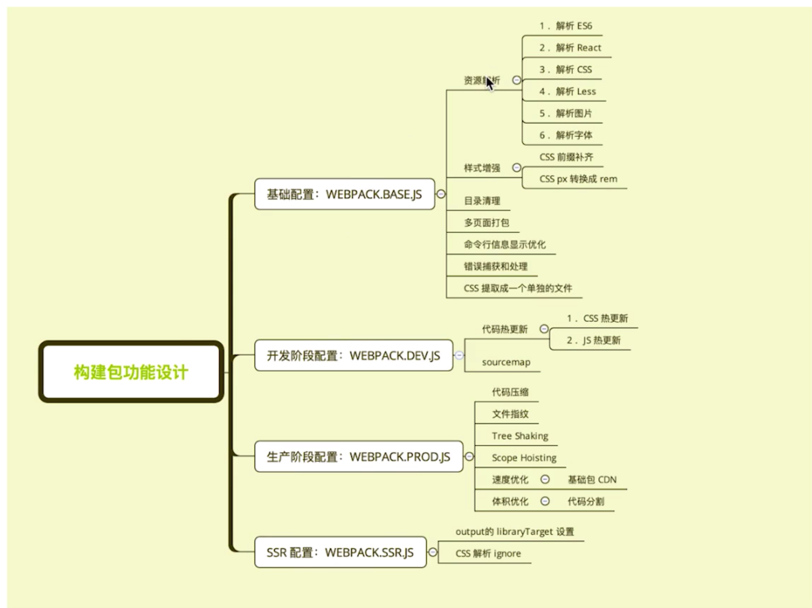

## 构建配置抽离成npm包

通用性：
* 业务开发者无需关注构建配置；
* 统一团队构建脚本；

可维护性：
* 构建配置合理拆分；
* README文档、ChangeLog文档；

质量：
* 冒烟测试、单元测试、测试覆盖率；
* 持续集成；

<!--more-->

### 构建配置管理的可选方案

* 多个配置文件管理不同环境的构建，通过 webpack --config进行控制；
* 构建配置封装成库，如：hjs-webpack、Neutrino、webpack-blocks；
* 抽成命令行构建工具，如：create-react-app；（适合大规模团队）
* 所有配置放在一个文件里，通过--env参数控制分支选择；

### 构建配置包设计

多个配置文件管理不同环境webpack配置：
* 基础配置：webpack.base.js；
* 开发环境：webpack.dev.js；
* 生产环境：webpack.prod.js；
* SSR环境：webpack.ssr.js；

抽离成npm包统一管理：
* 规范：git commit日志、README、eslint规范、semver规范（语义化版本）；
* 质量：冒烟测试、单元测试、测试覆盖率和CI（持续集成）；

### 组合配置
通过webpack-merge组合配置

```
const merge = require('webpack-merge');

merge(
  { a: [1], b: 5, c: 20 },
  { a: [2], b: 10, d: 421 }
)

// 合并结果
{ 
  a: [1, 2], b: 10, c: 20, d: 421
}

// 导出
module.exports = merge(config1, config2)
```

### 功能模块设计


<div style="clear: both"></div>

### 目录结构

lib存放源代码，test存放测试代码：
```
|- /test
|- / lib
  |- /webpack.dev.js
  |- /webpack.prod.js
  |- /webpack.ssr.js
  |- /webpack.base.js
|- README.md
|- CHANGELOG.md
|- .eslintrc.js
|- package.json
|- index.js
```

### 使用eslint规范构建脚本

使用eslint-config-airbnb-base （构建脚本无需包含框架语法：vue、react）

小诀窍：可以自动处理空格、逗号、换行等小问题
```
eslint --fix
```

需安装：
```
npm i -D babel-eslint eslint eslint-config-airbnb-base eslint-plugin-import
```
.eslintrc.js配置：
```
module.exports = {
  parser: "babel-eslint", // 解析器
  extends: "airbnb-base", // 继承airbnb配置
  env: {
    browser: true,
    node: true
  }
}
```

配置运行命令脚本：（package.json）
```
{
  "scripts": {
    "eslint": "eslint ./lib --fix"
  }
}
```

**注意：因为整个构建包需要发布，构建里用到的插件依赖需要记录到dependencies里（非dev）**

---------------------------------

## 冒烟测试的运用

定义：冒烟测试是指提交测试的软件在进行深入测试之前而进行的预测试，主要目的是暴露会导致软件重新发布的严重问题（例如基本功能失效等）。

**构建包执行冒烟测试需要检查：**
* 构建是否成功；
* 每次构建的输出目录是否有内容产生；
（是否有js、css等静态文件；是否有html文件）

### 检查构建是否成功：

示例：smoke/index.js
```
const path = require('path');
const webpack = require('webpack');
const rimraf = require('rimraf');
const Mocha = require('mocha');

const mocha = new Mocha({
  timeout: '10000ms',
});

// 进入template目录
process.chdir(path.join(__dirname, 'template'));

// 清空dist文件夹
rimraf('./dist', () => {
  const prodConfig = require('../../lib/webpack.prod'); // eslint-disable-line
  // 清空后回调，运行打包配置
  webpack(prodConfig, (err, stats) => {
    if (err) {
      console.log('build error');
      console.log(err); // eslint-disable-line
      // 抛出错误码
      process.exit(2);
    }

    console.log(stats.toString({ // eslint-disable-line
      colors: true,
      modules: false,
      children: false,
    }));

    console.log('Webpack build success, begin run test'); // eslint-disable-line

    mocha.addFile(path.join(__dirname, 'html-test.js')); // mocha测试用例
    mocha.addFile(path.join(__dirname, 'css-js-test.js')); // mocha测试用例

    mocha.run();
  });
});

```

### 检查基本功能是否正常：（使用mocha测试框架）

示例：html-test.js
```
// 检查是否生成了html文件
const glob = require('glob-all');

describe('Checking generated html files', () => {
  it('should generate html files', (done) => {
    const files = glob.sync([
      './dist/index.html',
      './dist/search.html',
    ]);

    if (files.length > 0) {
      done();
    } else {
      throw new Error('no html files generated');
    }
  });
});

```

---------------------------------

## 单元测试与测试覆盖率

### 测试工具分类：
* 单纯的测试框架（需要断言库：chai、should.js、expect、better-assert）：mocha、ava；
* 集成框架，开箱即用：jasmine、jest；
* 极简API；

### 编写单元测试用例：
* 使用：mocha + chai
* api: describe（描述测试文件）、it（一个it表示一个测试用例）、expect（断言）
* 测试命令：mocha test.js

### 单元测试接入：
1. 安装 mocha + chai + assert；
```
npm i mocha chai assert -D
```
2. 新建test目录，添加index.js测试入口文件；
```
const path = require('path');

process.chdir(path.join(__dirname, 'smoke/template'));

describe('builder-webpack test case', () => {
  require('./unit/webpack-base-test'); // 引入单元测试文件
});
```

3. 单元测试文件，测试用例编写：
```
const assert = require('assert');

describe('webpack.base.js test case', () => {
  const baseConfig = require('../../lib/webpack.base.js');

  it('entry', () => {
    assert.equal(baseConfig.entry.index, '/Users/harryyin/Documents/fe-workspace/webpack-test/builder-webpack/test/smoke/template/src/index/index.js');
    assert.equal(baseConfig.entry.search, '/Users/harryyin/Documents/fe-workspace/webpack-test/builder-webpack/test/smoke/template/src/search/index.js');
  });
});
```
4. 在package.json中新增test脚本；
```
{
  "scripts": {
    "test": "node_modules/mocha/bin/_mocha"
  }
}
```
5. 执行测试命令；
```
npm run test
```

### 测试覆盖率

安装使用istanbul：
```
npm i istanbul -D
```

修改package.json的命令脚本：
```
{
  "scripts": {
    "test": "istanbul cover ./node_modules/.bin/mocha"
  }
}
```