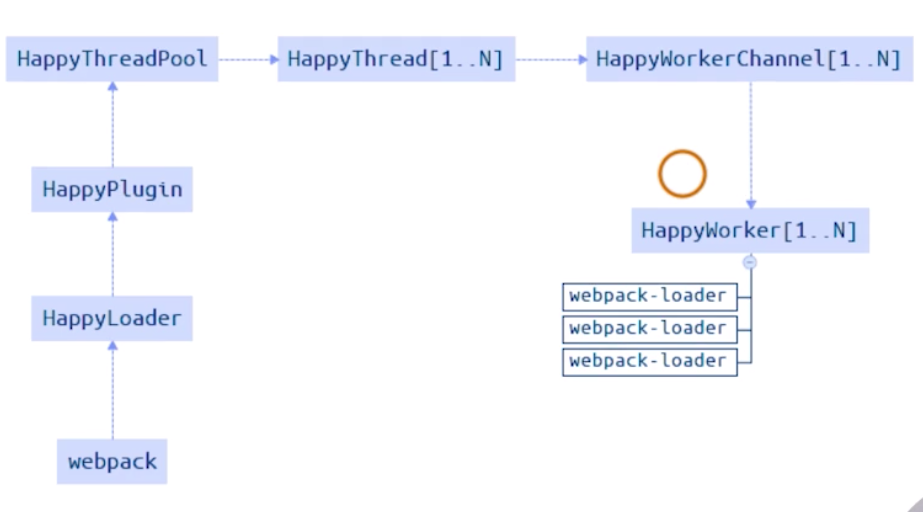

## webpack构建性能初级分析

**使用webpack内置stats获取构建统计信息**

### 使用方式一：package.json配置

```
// 会输出stats.json文件
{
  "scripts": {
    "build:stats": "webpack --env production --json > stats.json"
  }
}
```

<!--more-->

### 使用方式二：node.js中使用

```
const webpack = require('webpack');
const config = require('./webpack.config.js');

webpack(config, (err, stats) => {
  if (err) {
    return console.error(err);
  }
  if (stats.hasErrors()) {
    return console.error(stats.toString('errors-only'));
  }
  console.log(stats);
})

```

-----------------------------------

## webpack构建速度分析

**使用speed-measure-webpack-plugin，可以看到每个loader和插件执行耗时**

安装插件：
```
npm i -D speed-measure-webpack-plugin
```

使用方法：
```
const SpeedMeasurePlugin = require('speed-measure-webpack-plugin');

const smp = new SpeedMeasurePlugin();

const webpackConfig = smp.wrap({
  plugins: [
    new MyPlugin(),
    new MyOtherPlugin()
  ]
});

```

-----------------------------------

## webpack构建体积分析

**使用webpack-bundle-analyzer，构建完成后会在8888端口展示大小**

安装插件：
```
npm i -D webpack-bundle-analyzer
```
使用方法：
```
const BundleAnalyzerPlugin = require('webpack-bundle-analyzer').BundleAnalyzerPlugin;

module.exports = {
  plugins: [
    new BundleAnalyzerPlugin()
  ]
}
```

利用此工具可以用来分析：
* 第三方依赖模块文件大小；
* 业务组件代码大小；

-----------------------------------

## 构建速度优化

### 使用高版本的webpack和node.js

**webpack4性能提升的原因**

* V8引擎：for of 代替 forEach、Map 和 Set 代替 Object、includes 代替 indexOf；
* 默认使用更快的md4 hash算法代替md5；
* webpack AST可以直接从loader传递给AST，减少解析时间；
* 使用字符串代替正则表达式；

### 多进程、多实例构建

可选方案：
* happy-pack 
* thread-loader
* parallel-webpack

#### 使用happy-pack解析资源（webpack4以前的做法）

**原理：每次webpack解析一个模块，HappyPack会将该模块及其依赖分配给worker线程。**

处理流程：


<div style="clear: both"></div>

使用方法：
```
exports.plugins = [
  new HappyPack({
    id: 'jsx',
    thread: 4,
    loaders: ['babel-loader']
  }),
  new HappyPack({
    id: 'styles',
    thread: 2,
    loaders: ['style-loader', 'css-loader', 'less-loader']
  })
]
```

#### 使用thread-loader解析资源

**原理：每次webpack解析一个模块时，thread-loader会将该模块及其依赖分配给worker线程中。**

安装thread-loader
```
npm i -D thread-loader
```

使用方法：
```
module.exports = {
  module: {
    rules: [
      {
        test: /\.js$/,
        use: [
          {
            loader: 'thread-loader',
            options: {
              workers: 3
            }
          },
          'babel-loader'
        ]
      }
    ]
  }
}
```

### 多进程、多实例并行压缩代码

#### 方法一：使用parallel-uglify-plugin

```
const ParallelUglifyPlugin = require('parallel-uglify-plugin')

module.exports = {
  plugins: [
    new ParallelUglifyPlugin({
      uglifyJS: {
        output: {
          beautify: false,
          comments: false
        },
        compress: {
          warnings: false,
          drop_console: true,
          collapse_vars: true,
          reduce_vars: true
        }
      }
    })
  ]
}
```

#### 方法二：使用uglifyjs-webpack-plugin开启parallel

```
const UglifyJSPlugin = require('uglifyjs-webpack-plugin')

module.exports = {
  plugins: [
    new UglifyJSPlugin({
      uglifyOptions: {
        warning: false,
        mangle: true,
        toplevel: false,
        ie8: false, 
        keep_fnames: false
      },
      parallel: true
    })
  ]
}
```

#### 方法三：使用terser-webpack-plugin开启parallel

```
const TerserPlugin = require('terser-webpack-plugin');

module.exports = {
  optimization: {
    minimizer: [
      new TerserPlugin({
        parallel: true
      })
    ]
  }
}
```

### 进一步分包：预编译资源模块

思路：将react、react-dom基础包打包成一个文件。
方法：使用dll-plugin进行分包，生成分离后包的描述文件manifest.json，webpack可以通过DllReferencePlugin对manifest.json引用自动关联分离的包，每次构建无需处理基础包内容。

用于分包的webpack.dll.js

```
module.exports = {
  entry: {
    library: [
      'react',
      'react-dom'
    ]
  },
  output: {
    filename: '[name].dll.js',
    path: path.join(__dirname, 'build/library'),
    library: '[name]' // 暴露出来的库名
  },
  plugins: [
    new webpack.DllPlugin({
      name: '[name]',
      path: path.join(__dirname, 'build/library/[name].json'),
    })
  ]
}
```

新增分包的命令脚本
```
{
  "scripts": {
    "dll": "webpack --config webpack.dll.js"
  }
}
```

构建配置：webpack.prod.js
```
module.exports = {
  plugins: [
    new webpack.DllReferencePlugin({
      manifest: require('./build/library/library.json')
    })
  ]
}
```

### 利用缓存提升二次构建速度

**缓存思路：**
* babel-loader开启缓存；
* terser-webpack-plugin开启缓存；
* 使用cache-loader或者hard-source-webpack-plugin；

```
const TerserPlugin = require('terser-webpack-plugin');

module.exports = {
  optimization: {
    minimizer: [
      new TerserPlugin({
        parallel: true,
        cache: true
      })
    ]
  }
}
```

### 缩小构建目标

目的：尽可能少构建模块（例如：babel-loader不解析node_modules）

**减少文件搜索范围**

* 优化resolve.modules配置（减少模块搜索层级）；
* 优化resolve.mainFields配置；
* 优化resolve.extensions配置；
* 合理使用alias

```
module.exports = {
  resolve: {
    alias: {
      react: path.resolve(__dirname, './node_modules/react/dist/react.min.js')
    },
    modules: [path.resolve(__dirname, 'node_modules')],
    extensions: ['.js'], // js模块可以省略后缀
    mainFields: ['main'] // 查找入口文件，直接读取package.json指定的main字段
  },
  module: {
    rules: [
      {
        test: /\.js$/,
        include: path.resolve('src') // 只解析src下的js
      }
    ]
  }
}
```

-----------------------------------

## 构建体积优化

### 利用tree shaking删除无用的js、css

#### 删除无用的css
**方法一：使用purgecss-webpack-plugin**
和mini-css-extract-plugin配合使用，识别已经用到的css class,

安装插件：
```
npm i -D purgecss-webpack-plugin
```

使用方法：
```
const PurgecssPlugin = require('purgecss-webpack-plugin');

const PATHS = {
  src: path.join(__dirname, 'src')
};

module.exports = {
  plugins: [
    new PurgecssPlugin({
      paths: glob.sync(`${PATHS.src}/**/*`,  { nodir: true }),
    })
  ]
}
```

**方法二：使用uncss**

html通过jsdom加载，所有样式通过postcss解析，通过document.querySelector来识别不存在的css选择器。

### 利用webpack进行图片压缩

使用image-webpack-loader（基于node的 imagemin）

* 有很多定制选择；
* 支持多种图片格式；
* 可以引入第三方优化插件；

### 使用动态polyfill服务

背景：babel-polyfill打包后体积占比很大。

解决方案：利用polyfill-service：根据不同浏览器UA（user-agent）返回不同的polyfill。