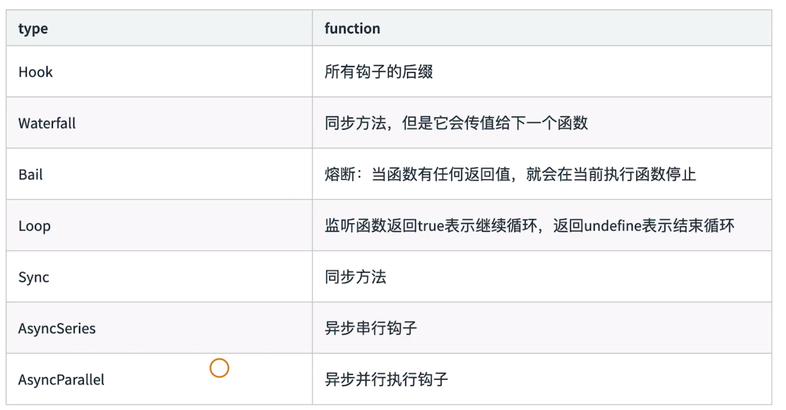

## webpack启动过程分析

### 查找webpack入口文件

启动webpack后，npm会让命令行工具进入node_modules/.bin目录下，查找是否存在webpack.sh或者webpack.cmd文件，若存在就执行，否则就抛出错误。

**因此，实际的入口文件是：node_modules/webpack/bin/webpack.js**

<!--more-->

### 分析webpack的入口文件：webpack.js

```
process.exitCode = 0; // 正常执行返回0

const runCommand = (command, args) => {} // 运行某个命令

const isInstalled = packageName => {} // 判断某个包是否安装

const CLIs = [] // webpack可用的cli：webpack-cli和webpack-command，只能使用其中之一
```

**启动后结果：webpack最终找到webpack-cli（或webpack-command）这个npm包，并执行cli。**

-------------------------------------

## webpack-cli源码分析

整体工作流程：
* 引入yargs，对命令行进行定制；
* 分析命令行参数，对各参数进行转换，组成编译配置项；
* 引用webpack，根据配置项进行编译和构建；

通过NON_COMPILATION_ARGS常量数组分析不需要编译的命令：
```
// webpack-cli/bin/utils/constants
const NON_COMPILATION_ARGS = [
  "init", // 创建webpack配置文件 
  "migrate", // 进行webpack版本迁移
  "serve", // 运行webpack-serve
  "generate-loader", // 生成webpack loader
  "generate-plugin", // 生成plugin
  "info" // 返回与本地环境相关的信息
];

// webpack-cli/bin/cli.js
const { NON_COMPILATION_ARGS } = require("./utils/constants");

const NON_COMPILATION_CMD = process.argv.find(arg => {
  if (arg === "serve") {
    global.process.argv = global.process.argv.filter(a => a !== "serve");
    process.argv = global.process.argv;
  }
  return NON_COMPILATION_ARGS.find(a => a === arg);
});

if (NON_COMPILATION_CMD) {
  return require("./utils/prompt-command")(NON_COMPILATION_CMD, ...process.argv);
}
```

**命令行工具包yargs介绍**

* 提供命令和分组参数；
* 动态生成help信息；

**webpack-cli执行结果：webpack-cli对配置文件和命令行参数进行转换生成最终配置选项options，根据options实例化webpack对象，然后执行构建流程。**

-------------------------------------

## Tapable插件架构和Hooks设计

**webpack的本质：基于事件流的编程范例，一系列插件运行。** 

源码分析：
* webpack核心类Compiler、Compilation都继承自Tapable；
* Tapable是一个类似于node.js的eventEmitter的库，主要用于控制钩子函数的发布与订阅，掌控着webpack的插件系统；
* Tapable暴露了很多Hook类，为插件提供挂载的钩子；

Hooks的类型：

<div style="clear: both"></div>

Tapable使用hooks方法：
```
const { SyncHook } = require('tapable');

const hook1 = new SyncHook(['arg1', 'arg2', 'arg3']);

// 绑定事件到webpack事件流
hook1.tap('hook', (arg1, arg2, arg3) => { console.log(arg1, arg2, arg3) })

// 触发绑定的事件
hook1.call(1, 2, 3)
```

-------------------------------------

## Tapable如何与webpack进行关联

模拟Compiler.js
```
module.exports = class Compiler {
  constructor () {
    this.hooks = {
      accelerate: new SyncHook(['newspeed']),
      break: new SyncHook(),
      calculateRoutes: new AsyncSeriesHook(['source', 'target', 'routesList'])
    }
  }

  run () {
    this.accelerate(10);
    this.break();
    this.calculateRoutes('Async', 'hook', 'demo');
  }

  accelerate (speed) {
    this.hooks.accelerate.call(speed);
  }

  break () {
    this.hooks.break.call();
  }

  calculateRoutes () {
    this.hooks.calculateRoutes.promise(...arguments).then(() => {}, err => {
      console.log(err);
    })
  }
}
```

模拟插件my-plugin.js
```
class MyPlugin {
  constructor () {}

  apply (compiler) {
    compiler.hooks.break.tap('WarningLampPlugin', () => { console.log('WarningLampPlugin') });
    compiler.hooks.calculateRoutes.tapPromise('calculateRoutes tapAsync', (source, target, routesList) => {
      return new Promise((resolve, reject) => {
        setTimeout(() => {
          console.log(`tapPromise to ${source} ${target} ${routesList}`);
          resolve();
        }, 1000)
      })
    })
  }
}
```

模拟插件运行
```
const myPlugin = new MyPlugin();

const options = {
  plugins: [ myPlugin ]
}

const compiler = new Compiler();

for (const plugin of options.plugins) {
  if (typeof plugin === 'function') {
    plugin.call(compiler, compiler);
  } else {
    plugin.apply(compiler);
  }
}

compiler.run();
```

-------------------------------------

## webpack构建流程：准备阶段

* 初始化options
* 开始编译
* 从entry开始递归分析依赖，对每个依赖模块进行build
* 对模块位置进行解析
* 开始构建某个模块
* 模块加载loader完成后进行编译，生成AST树
* 遍历AST树，遇到require时收集依赖
* 所有依赖build完成，开始优化
* 输出到dist目录

### WebpackOptionsApply
将所有配置options参数转换成webpack内部插件

示例：
```
output.library > LibraryTemplatePlugin
externals > ExternalsPlugin
devtool > EvalDevtoolModulePlugin, SourceMapDevToolPlugin
```

-------------------------------------

## webpack构建流程：模块构建、chunk生成阶段

Compiler Hooks（流程相关）：
* before-run；
* before-compile，after-compile；
* make；
* emit，after-emit；
* done；

Compiler Hooks（监听相关）：
* watch-run；
* watch-close；

Compiler调用Compilation生命周期方法：
* addEntry -> addModuleChain；
* finish（上报模块错误）；
* seal（封装）；

NormalModule构建：
* 使用loader-runner运行loader；
* 通过parser解析(内部是acron)；
* ParserPlugins添加依赖；

Compilation Hooks（模块相关）：
* build-module；
* failed-module；
* succeed-module；

Compilation Hooks（资源生成相关）：
* module-asset；
* chunk-asset；

**Chunk生成算法**
1. webpack先将entry中的module都对应生成一个chunk；
2. 遍历module的依赖列表，将依赖的模块也加入到chunk；
3. 如果其中依赖的模块是动态引入的，那么就会为其创建一个新的chunk，继续遍历依赖；
4. 重复上述过程，直至得到所有chunks；

-------------------------------------

## webpack构建流程：文件生成阶段
