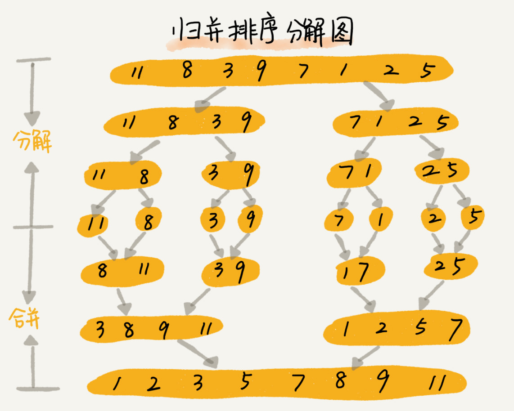

### 归并排序

**原理：归并排序的核心思想还是蛮简单的。如果要排序一个数组，我们先把数组从中间分成前后两部分，然后对前后两部分分别排序，再将排好序的两部分合并在一起，这样整个数组就都有序了。**

示例：

<div style="clear: both"></div>

<!--more-->

归并排序使用的就是分治思想。分治思想跟我们前面讲的递归思想很像。是的，分治算法一般都是用递归来实现的。分治是一种解决问题的处理思想，递归是一种编程技巧，这两者并不冲突。

#### 归并排序的实现

伪代码实现归并排序算法：
```
// 归并排序算法, A是数组，n表示数组大小
merge_sort(A, n) {
  merge_sort_c(A, 0, n-1)
}

// 递归调用函数
merge_sort_c(A, p, r) {
  // 递归终止条件
  if p >= r  then return

  // 取p到r之间的中间位置q
  q = (p+r) / 2
  // 分治递归
  merge_sort_c(A, p, q)
  merge_sort_c(A, q+1, r)
  // 将A[p...q]和A[q+1...r]合并为A[p...r]
  merge(A[p...r], A[p...q], A[q+1...r])
}
```

merge(A[p…r], A[p…q], A[q+1…r]) 这个函数的作用就是，将已经有序的 A[p…q]和 A[q+1…r]合并成一个有序的数组，并且放入 A[p…r]。
**具体思路：**我们申请一个临时数组 tmp，大小与 A[p…r]相同。我们用两个游标 i 和 j，分别指向 A[p…q]和 A[q+1…r]的第一个元素。比较这两个元素 A[i]和 A[j]，如果 A[i]<=A[j]，我们就把 A[i]放入到临时数组 tmp，并且 i 后移一位，否则将 A[j]放入到数组 tmp，j 后移一位。
继续上述比较过程，直到其中一个子数组中的所有数据都放入临时数组中，再把另一个数组中的数据依次加入到临时数组的末尾，这个时候，临时数组中存储的就是两个子数组合并之后的结果了。最后再把临时数组 tmp 中的数据拷贝到原数组 A[p…r]中。

merge的逻辑如图：

<div style="clear: both"></div>

merge的伪代码实现：
```
merge(A[p...r], A[p...q], A[q+1...r]) {
  var i := p，j := q+1，k := 0 // 初始化变量i, j, k
  var tmp := new array[0...r-p] // 申请一个大小跟A[p...r]一样的临时数组
  while i<=q AND j<=r do {
    if A[i] <= A[j] {
      tmp[k++] = A[i++] // i++等于i:=i+1
    } else {
      tmp[k++] = A[j++]
    }
  }
  
  // 判断哪个子数组中有剩余的数据
  var start := i，end := q
  if j<=r then start := j, end:=r
  
  // 将剩余的数据拷贝到临时数组tmp
  while start <= end do {
    tmp[k++] = A[start++]
  }
  
  // 将tmp中的数组拷贝回A[p...r]
  for i:=0 to r-p do {
    A[p+i] = tmp[i]
  }
}
```

#### 归并排序的性能分析

##### 稳定性
* 归并排序稳不稳定关键要看 merge() 函数
* 在合并的过程中，如果 A[p…q]和 A[q+1…r]之间有值相同的元素，那我们可以像伪代码中那样，先把 A[p…q]中的元素放入 tmp 数组。这样就保证了值相同的元素，在合并前后的先后顺序不变。所以，归并排序是一个稳定的排序算法。

##### 时间复杂度
**不仅递归求解的问题可以写成递推公式，递归代码的时间复杂度也可以写成递推公式。**
我们假设对 n 个元素进行归并排序需要的时间是 T(n)，那分解成两个子数组排序的时间都是 T(n/2)。我们知道，merge() 函数合并两个有序子数组的时间复杂度是 O(n)。所以，套用前面的公式，归并排序的时间复杂度的计算公式就是：
```
T(1) = C；   n=1时，只需要常量级的执行时间，所以表示为C。
T(n) = 2*T(n/2) + n； n>1
// 再进一步分解一下计算过程
T(n) = 2*T(n/2) + n
     = 2*(2*T(n/4) + n/2) + n = 4*T(n/4) + 2*n
     = 4*(2*T(n/8) + n/4) + 2*n = 8*T(n/8) + 3*n
     = 8*(2*T(n/16) + n/8) + 3*n = 16*T(n/16) + 4*n
     ......
     = 2^k * T(n/2^k) + k * n
     ......
```
通过这样一步一步分解推导，我们可以得到 T(n) = 2^kT(n/2^k)+kn。当 T(n/2^k)=T(1) 时，也就是 n/2^k=1，我们得到 k=log2n 。我们将 k 值代入上面的公式，得到 T(n)=Cn+nlog2n 。如果我们用大 O 标记法来表示的话，T(n) 就等于 O(nlogn)。
所以归并排序的时间复杂度是 **O(nlogn)**。

##### 空间复杂度
**归并排序不是原地排序算法，**这是因为归并排序的合并函数，在合并两个有序数组为一个有序数组时，需要借助额外的存储空间。
递归代码的空间复杂度并不能像时间复杂度那样累加。刚刚我们忘记了最重要的一点，那就是，尽管每次合并操作都需要申请额外的内存空间，但在合并完成之后，临时开辟的内存空间就被释放掉了。在任意时刻，CPU 只会有一个函数在执行，也就只会有一个临时的内存空间在使用。临时内存空间最大也不会超过 n 个数据的大小，所以**空间复杂度是 O(n)**。

------------------------------------------

### 快速排序
**原理：快排利用的也是分治思想。乍看起来，它有点像归并排序，但是思路其实完全不一样。**
1. 如果要排序数组中下标从 p 到 r 之间的一组数据，我们选择 p 到 r 之间的任意一个数据作为 pivot（分区点）。
2. 我们遍历 p 到 r 之间的数据，将小于 pivot 的放到左边，将大于 pivot 的放到右边，将 pivot 放到中间。经过这一步骤之后，数组 p 到 r 之间的数据就被分成了三个部分，前面 p 到 q-1 之间都是小于 pivot 的，中间是 pivot，后面的 q+1 到 r 之间是大于 pivot 的。
3. 根据分治、递归的处理思想，我们可以用递归排序下标从 p 到 q-1 之间的数据和下标从 q+1 到 r 之间的数据，直到区间缩小为 1，就说明所有的数据都有序了。

#### 快速排序的实现

伪代码实现：
```
// 快速排序，A是数组，n表示数组的大小
quick_sort(A, n) {
  quick_sort_c(A, 0, n-1)
}
// 快速排序递归函数，p,r为下标
quick_sort_c(A, p, r) {
  if p >= r then return
  
  q = partition(A, p, r) // 获取分区点
  quick_sort_c(A, p, q-1)
  quick_sort_c(A, q+1, r)
}
```
其中partition() 分区函数就是随机选择一个元素作为 pivot（一般情况下，可以选择 p 到 r 区间的最后一个元素），然后对 A[p…r]分区，函数返回 pivot 的下标。为了保证空间复杂度得是 O(1)，原地分区函数的实现思路非常巧妙，具体逻辑如下：
```
partition(A, p, r) {
  pivot := A[r]
  i := p
  for j := p to r-1 do {
    if A[j] < pivot {
      swap A[i] with A[j]
      i := i+1
    }
  }
  swap A[i] with A[r]
  return i
}
```

这里的处理有点类似选择排序。我们通过游标 i 把 A[p…r-1]分成两部分。A[p…i-1]的元素都是小于 pivot 的，我们暂且叫它“已处理区间”，A[i…r-1]是“未处理区间”。我们每次都从未处理的区间 A[i…r-1]中取一个元素 A[j]，与 pivot 对比，如果小于 pivot，则将其加入到已处理区间的尾部，也就是 A[i]的位置。

整个分区逻辑如图所示：

<div style="clear: both"></div>

#### 快速排序的性能分析

综上所述，快排是一种原地、不稳定的排序算法。

**时间复杂度：**
快排也是用递归来实现的。对于递归代码的时间复杂度，我前面总结的公式，这里也还是适用的。如果每次分区操作，都能正好把数组分成大小接近相等的两个小区间，那快排的时间复杂度递推求解公式跟归并是相同的。所以，快排的时间复杂度也是 O(nlogn)。
但是，公式成立的前提是每次分区操作，我们选择的 pivot 都很合适，正好能将大区间对等地一分为二。但实际上这种情况是很难实现的。
我举一个比较极端的例子。如果数组中的数据原来已经是有序的了，比如 1，3，5，6，8。如果我们每次选择最后一个元素作为 pivot，那每次分区得到的两个区间都是不均等的。我们需要进行大约 n 次分区操作，才能完成快排的整个过程。每次分区我们平均要扫描大约 n/2 个元素，这种情况下，快排的时间复杂度就从 O(nlogn) 退化成了 O(n2)。
我们刚刚讲了两个极端情况下的时间复杂度，一个是分区极其均衡，一个是分区极其不均衡。它们分别对应快排的最好情况时间复杂度和最坏情况时间复杂度。
实际上，递归的时间复杂度的求解方法除了递推公式之外，还有递归树，在树那一节我再讲，这里暂时不说。我这里直接给你结论：T(n) 在大部分情况下的时间复杂度都可以做到 O(nlogn)，只有在极端情况下，才会退化到 O(n2)。

### 解决问题：O(n) 时间复杂度内求无序数组中的第 K 大元素

快排核心思想就是分治和分区，我们可以利用分区的思想，来解答开篇的问题：O(n) 时间复杂度内求无序数组中的第 K 大元素。比如，4， 2， 5， 12， 3 这样一组数据，第 3 大元素就是 4。
我们选择数组区间 A[0…n-1]的最后一个元素 A[n-1]作为 pivot，对数组 A[0…n-1]原地分区，这样数组就分成了三部分，A[0…p-1]、A[p]、A[p+1…n-1]。
如果 p+1=K，那 A[p]就是要求解的元素；如果 K>p+1, 说明第 K 大元素出现在 A[p+1…n-1]区间，我们再按照上面的思路递归地在 A[p+1…n-1]这个区间内查找。同理，如果 K<p+1，那我们就在 A[0…p-1]区间查找。

**分析其时间复杂度：**
第一次分区查找，我们需要对大小为 n 的数组执行分区操作，需要遍历 n 个元素。第二次分区查找，我们只需要对大小为 n/2 的数组执行分区操作，需要遍历 n/2 个元素。依次类推，分区遍历元素的个数分别为、n/2、n/4、n/8、n/16.……直到区间缩小为 1。
如果我们把每次分区遍历的元素个数加起来，就是：n+n/2+n/4+n/8+…+1。这是一个等比数列求和，最后的和等于 2n-1。所以，上述解决思路的时间复杂度就为 O(n)。