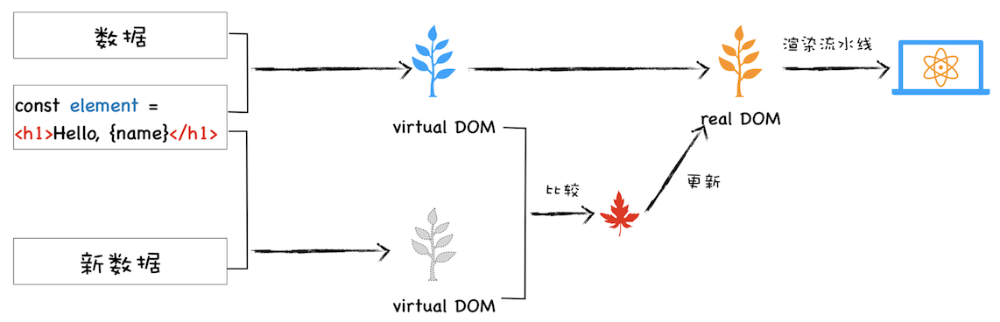
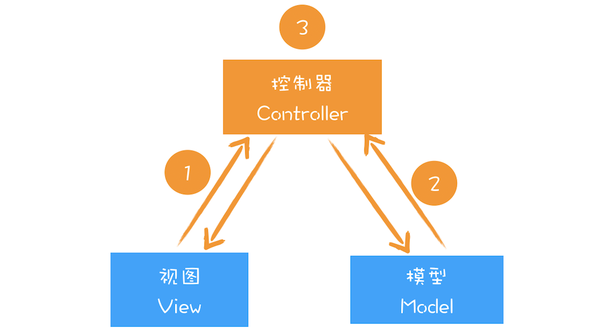

### DOM的缺陷

通过js操作修改dom结构，会触发样式计算、布局、绘制、栅格化、合成等任务，我们把这一过程称为重排。除了重排之外，还有可能引起重绘或者合成操作，形象地理解就是“牵一发而动全身”。另外，对于 DOM 的不当操作还有可能引发强制同步布局和布局抖动的问题，这些操作都会大大降低渲染效率。因此，对于 DOM 的操作我们时刻都需要非常小心谨慎。
对于简单的页面来说，其 DOM 结构还是比较简单的，所以以上这些操作 DOM 的问题并不会对用户体验产生太多影响。但是对于一些复杂的页面或者目前使用非常多的单页应用来说，其 DOM 结构是非常复杂的，而且还需要不断地去修改 DOM 树，每次操作 DOM 渲染引擎都需要进行重排、重绘或者合成等操作，因为 DOM 结构复杂，所生成的页面结构也会很复杂，对于这些复杂的页面，执行一次重排或者重绘操作都是非常耗时的，这就给我们带来了真正的性能问题。
我们需要有一种方式来减少 JavaScript 对 DOM 的操作，这时候虚拟 DOM 就上场了。

<!--more-->

### 什么是虚拟DOM

React 中虚拟 DOM 执行流程图：

* **创建阶段**：首先依据 JSX 和基础数据创建出来虚拟 DOM，它反映了真实的 DOM 树的结构。然后由虚拟 DOM 树创建出真实 DOM 树，真实的 DOM 树生成完后，再触发渲染流水线往屏幕输出页面；
* **更新阶段**：如果数据发生了改变，那么就需要根据新的数据创建一个新的虚拟 DOM 树；然后 React 比较两个树，找出变化的地方，并把变化的地方一次性更新到真实的 DOM 树上；最后渲染引擎更新渲染流水线，并生成新的页面；

### 双缓存

在开发游戏或者处理其他图像的过程中，屏幕从前缓冲区读取数据然后显示。但是很多图形操作都很复杂且需要大量的运算，比如一幅完整的画面，可能需要计算多次才能完成，如果每次计算完一部分图像，就将其写入缓冲区，那么就会造成一个后果，那就是在显示一个稍微复杂点的图像的过程中，你看到的页面效果可能是一部分一部分地显示出来，因此在刷新页面的过程中，会让用户感受到界面的闪烁。
而使用双缓存，可以让你先将计算的中间结果存放在另一个缓冲区中，等全部的计算结束，该缓冲区已经存储了完整的图形之后，再将该缓冲区的图形数据一次性复制到显示缓冲区，这样就使得整个图像的输出非常稳定。
在这里，你可以把虚拟 DOM 看成是 DOM 的一个 buffer，和图形显示一样，它会在完成一次完整的操作之后，再把结果应用到 DOM 上，这样就能减少一些不必要的更新，同时还能保证 DOM 的稳定输出。

### MVC 模式
在各大设计模式当中，MVC 是一个非常重要且应用广泛的模式，因为它能将数据和视图进行分离，在涉及到一些复杂的项目时，能够大大减轻项目的耦合度，使得程序易于维护。

通过上图你可以发现，MVC 的整体结构比较简单，由模型、视图和控制器组成，**其核心思想就是将数据和视图分离**，也就是说视图和模型之间是不允许直接通信的，它们之间的通信都是通过控制器来完成的。通常情况下的通信路径是视图发生了改变，然后通知控制器，控制器再根据情况判断是否需要更新模型数据。当然还可以根据不同的通信路径和控制器不同的实现方式，基于 MVC 又能衍生出很多其他的模式，如 MVP、MVVM 等，不过万变不离其宗，它们的基础骨架都是基于 MVC 而来。

我们可以把虚拟 DOM 看成是 MVC 的视图部分。